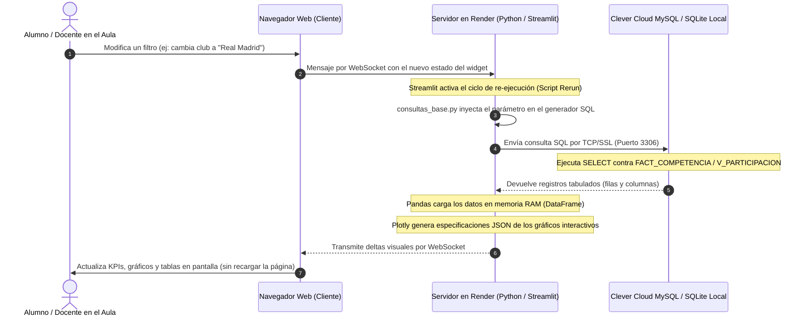

# Proyecto Data Warehouse: Competencia de Fútbol (Metodología HEFESTO v2)
## Bases de Datos Avanzadas — Trabajo Práctico Integrador y Tablero Analítico en la Nube

Repositorio oficial del proyecto de diseño, construcción, carga y explotación analítica de un Data Mart multidimensional bajo la metodología **HEFESTO v2**, desarrollado para la cátedra de **Bases de Datos Avanzadas (BDA)**.

El proyecto abarca desde el relevamiento inicial de requerimientos hasta el despliegue de un **Tablero Analítico Dinámico en Streamlit**, alojado en **Render** y conectado a **Clever Cloud MySQL** (con respaldo de contingencia offline).

---

## 🧭 Estructura General del Repositorio

```text
PROYECTO BDA/
├── README.md                           <- Este archivo (documentación central del repositorio)
├── RESUMEN_PARA_EL_GRUPO.md            <- Guía metodológica interna para el equipo
├── guia-tp-hefesto.md                  <- Consigna oficial de la cátedra
├── hefesto-v2.pdf                      <- Libro oficial de la metodología HEFESTO v2
├── render.yaml                         <- Especificación de infraestructura para despliegue en Render
│
├── paso-1/                             <- PASO 1: Requerimientos y Preguntas de Negocio
│   ├── README.md                       <- Guía del paso
│   └── entrega_requerimientos.md       <- Formulación de preguntas, indicadores y perspectivas
│
├── paso-2/                             <- PASO 2: Análisis de la Fuente de Datos
│   ├── README.md                       <- Guía del paso
│   ├── entrega_fuente_datos.md         <- Perfilado del CSV, 48 columnas reales y calidad
│   ├── fuente.md                       <- Metadatos y enlaces de descarga
│   └── verificacion_nombres_equipos.py <- Script de auditoría de inconsistencias y espacios
│
├── paso-3/                             <- PASO 3: Modelo Lógico del Data Warehouse
│   ├── README.md                       <- Guía del paso y justificación técnica
│   ├── entrega_modelo_logico.md        <- Diagrama lógico en estrella y granularidad
│   └── entrega_modelo_logico.sql       <- DDL oficial en MySQL 8.0 (dimensiones y hechos)
│
├── paso-4/                             <- PASO 4: Integración de Datos (ETL oficial en Python)
│   ├── README.md                       <- Guía de ejecución del proceso ETL
│   ├── entrega_informe.md              <- Informe técnico de calidad, balance y actualización
│   ├── 01_carga_dw.ipynb               <- Notebook interactivo oficial de ETL (Pandas + SQLAlchemy)
│   ├── EXPLICACION_ETL_PYTHON.md       <- Explicación pedagógica paso a paso para el grupo
│   ├── requirements.txt                <- Dependencias del pipeline ETL
│   ├── datos/
│   │   └── Matches.csv                 <- Dataset real de partidos (132.256 partidos en alcance)
│   └── mapeos/
│       ├── mapeo_divisiones.csv        <- 15 divisiones del alcance con país y nombre formal
│       └── mapeo_equipos.csv           <- Unificación de variantes ortográficas de clubes
│
└── entrega-final/                      <- ENTREGA FINAL: Tableros sobre el Modelo Estrella
    ├── README.md                       <- Guía del entregable final
    ├── dashboard.md                    <- Documento formal estático con las 6 preguntas seleccionadas
    ├── dashboard.ipynb                 <- Notebook interactivo con ejecución SQL local
    ├── generar_dashboard.py            <- Script generador autónomo de tablas y gráficos .png
    ├── requirements.txt                <- Dependencias de visualización
    ├── sql/
    │   └── 07_vista_dashboard.sql      <- DDL de la vista analítica auxiliar V_PARTICIPACION
    ├── graficos/                       <- Figuras PNG de las preguntas oficiales
    │
    └── dashboard-dinamico/             <- TABLERO WEB DINÁMICO (Streamlit + Plotly + Render/Clever Cloud)
        ├── README.md                   <- Guía de uso rápido del dashboard interactivo
        ├── MANUAL_EXPOSICION_Y_DESPLIEGUE.md <- Manual detallado de exposición y defensa oral
        ├── app.py                      <- Aplicación web interactiva en Streamlit
        ├── consultas_base.py           <- Catálogo de preguntas, generadores SQL y diccionario DW
        ├── conexion.py                 <- Gestor de conexiones (Clever Cloud / Local / Offline)
        ├── migrar_a_clevercloud.py     <- Script de migración CLI a Clever Cloud MySQL
        ├── exportar_dump_sql.py        <- Generador de dump SQL para phpMyAdmin
        ├── generar_sqlite_contingencia.py <- Compilador de base SQLite offline (132.256 partidos)
        ├── dw_contingencia.sqlite      <- Base local embebida para contingencia sin internet
        ├── Procfile                    <- Comando de inicio para servidores PaaS
        ├── render.yaml                 <- Blueprint declarativo para Render
        ├── requirements.txt            <- Dependencias de la app web
        └── .streamlit/config.toml      <- Configuración de tema oscuro y servidor headless
```

---

## ⚙️ ¿Qué Hace Cada Cosa en el Proyecto?

### 1. El Proceso ETL y el Data Mart (Pasos 1 a 4)
- **Proceso de Negocio:** *Competencia entre Equipos* (se estudia el resultado y contexto de cada partido).
- **Alcance Geográfico y Deportivo:** 15 divisiones y 10 países de Europa (5 ligas mayores y ligas de ascenso).
- **Granularidad:** 1 fila por cada partido oficial disputado.
- **Tabla de Hechos:** `FACT_COMPETENCIA` (132.256 registros reales, balance de pérdida 0 con respecto a la fuente limpia).
- **Tablas de Dimensiones:** `DIM_TIEMPO` (fechas y temporadas), `DIM_EQUIPO` (577 clubes canónicos), `DIM_DIVISION` (15 ligas), `DIM_PAIS` (10 naciones).
- **Vista Analítica:** `V_PARTICIPACION`, una vista lógica que proyecta cada partido dos veces (una desde la perspectiva local y otra visitante) para permitir agregaciones directas por club (`GROUP BY id_equipo`) sin alterar el modelo físico.

### 2. El Tablero Dinámico (`entrega-final/dashboard-dinamico/`)
Desarrollado en Python utilizando **Streamlit** y **Plotly**, permite proyectar los resultados en clase y adaptarlos en tiempo real:
- **6 Preguntas Oficiales Elegidas:**
  1. **P1:** Evolución de Elo en 5 años (caso testigo: *Nottingham Forest*, o cualquier club seleccionado).
  2. **P2:** Historial de Clásicos y Derbis Europeos (enfrentamientos tradicionales o duelo libre entre 2 clubes).
  3. **P3:** Ventaja de Localía y Diferencial de Goles en Europa.
  4. **P4:** Paridad Competitiva de Ligas (Segundas Divisiones vs Primeras).
  5. **P5:** Disciplina y Tarjetas por Liga (Clúster Ibérico vs Anglosajón).
  6. **P6:** Mejores Equipos Visitantes en el último lustro.
- **Múltiples Gráficos por Pregunta:** Cada pregunta incluye entre 2 y 3 gráficos complementarios (curvas de tendencia con bandas min-max, barras agrupadas, matrices de dispersión en cuadrantes y gráficos de dona) junto con tarjetas de KPIs destacados.
- **Editor SQL en Vivo:** Permite abrir un editor de texto, modificar la consulta SQL en tiempo real ante el docente y ver cómo se recalculan los gráficos en pantalla.
- **Consola SQL Libre:** Diseñada para responder cualquier consulta ad-hoc del profesor durante la defensa oral.

---

## 🔄 ¿Cómo Trabaja Render Tras Bambalinas? (Ciclo de Ejecución Reactivo)

Cuando el dashboard está desplegado en **Render** y un usuario interactúa con la interfaz (mueve un slider, selecciona un club o modifica una consulta SQL), ocurre el siguiente flujo técnico:



### Detalle de cada paso:
1. **Captura del Evento en el Cliente:** Cuando movés un slider (ej: ventana de años de 5 a 10) o escribís otro nombre de equipo, el navegador web no recarga la página por completo; envía un mensaje ligero mediante un túnel **WebSocket** persistente hacia el servidor de Render.
2. **Ciclo de Re-ejecución de Streamlit (*Rerun*):** Streamlit opera bajo un modelo reactivo: al recibir una interacción, vuelve a ejecutar el archivo `app.py` de arriba a abajo manteniendo el estado en memoria (`st.session_state`).
3. **Construcción Dinámica de la Consulta SQL:** El módulo `consultas_base.py` toma los nuevos valores de los controles y genera la sentencia SQL correspondiente, asegurando que la consulta vaya **estrictamente contra el Data Mart multidimensional** (`FACT_COMPETENCIA`, dimensiones o la vista `V_PARTICIPACION`).
4. **Ejecución en el Motor de Base de Datos:**
   - Si está seleccionado **Clever Cloud**, la consulta viaja a través de internet con cifrado SSL al servidor MySQL en Europa, aprovechando los índices creados (`idx_fc_local`, `idx_fc_visit`, `idx_fc_tiempo`, etc.).
   - Si está seleccionado **Modo Offline**, la consulta se ejecuta contra el motor SQLite embebido en el contenedor de Render.
5. **Transformación a DataFrame:** SQLAlchemy vuelca los datos en un DataFrame de `pandas`, calculando métricas derivadas y KPIs.
6. **Compilación de Gráficos en Plotly:** Plotly procesa las columnas y compila la representación visual en un objeto JSON interactivo.
7. **Renderizado en Pantalla:** Streamlit envía la actualización por WebSocket y el navegador dibuja los nuevos gráficos en milisegundos con capacidades de zoom, hover y descarga.

---

## 🛠️ Diagnóstico y Solución: Error al Elegir Clever Cloud en Render

Si al seleccionar **Clever Cloud MySQL** en Render experimentás un error, las causas técnicas más comunes y sus soluciones son:

### 1. La Base de Datos en Clever Cloud está vacía (Falta de Tablas)
- **Causa:** Creaste el add-on MySQL en Clever Cloud, pero todavía no ejecutaste la creación del esquema DDL ni la inserción de los 132.256 partidos. Al hacer una consulta, MySQL devuelve: `Table 'FACT_COMPETENCIA' doesn't exist`.
- **Solución Automática desde la Web (1 Clic):**
  1. En la barra lateral del dashboard, seleccioná **☁️ Clever Cloud MySQL**.
  2. Hacé clic en **"⚡ Test Conexión"**.
  3. La app detectará la conexión y mostrará el botón: **"🚀 Cargar Data Mart en Clever Cloud (1 Clic)"**.
  4. Hacé clic en ese botón: la aplicación en Render tomará los datos de la base de contingencia y los insertará automáticamente en Clever Cloud con barra de progreso.

### 2. Nombre de Base de Datos Incorrecto
- **Causa:** En Clever Cloud no podés elegir el nombre de la base de datos; el sistema le asigna un identificador único (ej: `b8qxxxxxxxx`). Si dejás el valor por defecto `dw_competencia_futbol`, MySQL arrojará `Unknown database 'dw_competencia_futbol'`.
- **Solución:** Copiá el campo **"Database Name"** que te da Clever Cloud (ej: `bxxxxxxxx`) y pegalo en la configuración de la app o en las variables de entorno de Render (`MYSQL_DATABASE`).

### 3. Variables de Entorno no Configuradas en Render
- **Causa:** En el panel de Render no se añadieron las 5 variables de entorno requeridas.
- **Solución:** En [dashboard.render.com](https://dashboard.render.com), entrá a tu servicio `bda-dashboard-futbol` $\rightarrow$ pestaña **Environment** y asegurate de tener:
  - `MYSQL_HOST`: el Host de Clever Cloud (ej: `bxxxx-mysql.services.clever-cloud.com`)
  - `MYSQL_PORT`: `3306`
  - `MYSQL_USER`: tu usuario de Clever Cloud (ej: `uxxxxxxxx`)
  - `MYSQL_PASSWORD`: tu contraseña de Clever Cloud
  - `MYSQL_DATABASE`: el nombre de la base de Clever Cloud (ej: `bxxxxxxxx`)

### 4. Modo de Contingencia (Plan B Inmediato)
Si la red de la universidad bloquea el puerto 3306 o no tenés conexión a internet, seleccioná en la barra lateral:  
👉 **`🛡️ Contingencia Offline (SQLite Local)`**.  
La app pasará a utilizar la base de datos local precompilada (`dw_contingencia.sqlite`) con exactamente los mismos **132.256 partidos**, permitiendo defender el trabajo sin depender de internet.

---

## 🎯 Guía de Uso del Dashboard durante la Exposición

### Paso 1: Apertura y Encuadre
1. Abrí la URL de Render (o `http://localhost:8501` si corrés en local).
2. Mostrá el estado de conexión verde en la esquina superior derecha.

### Paso 2: Recorrido por las 6 Preguntas Oficiales
1. En el selector de preguntas, navegá secuencialmente de la **Pregunta 1** a la **Pregunta 6**.
2. Por cada pregunta, utilizá las 4 pestañas:
   - **📊 Visualizaciones y KPIs:** Explicá los indicadores en las tarjetas superiores y mostrá los gráficos interactivos (hacé hover con el mouse sobre las barras y líneas para mostrar detalles numéricos).
   - **📋 Datos Tabulados:** Mostrá la tabla de datos completa y el botón para descargar en CSV.
   - **💻 Consulta SQL en Vivo:** Demostrá que la consulta se ejecuta exclusivamente sobre `FACT_COMPETENCIA` o `V_PARTICIPACION`.
   - **💡 Conclusión de Negocio:** Leé la conclusión estratégica para sponsors formulada bajo HEFESTO v2.

### Paso 3: Demostración Dinámica (A requerimiento del profesor)
- **Si el profesor pide cambiar de club en la P1:** Escribí `Arsenal` o `Real Madrid` en el casillero de club y cambiá el slider de años. La curva y las bandas se actualizarán de inmediato.
- **Si el profesor pide comparar dos clubes específicos en la P2:** Activá el checkbox `Comparar enfrentamiento libre entre 2 clubes`, elegí por ejemplo `Liverpool` vs `Chelsea` y mostrá el gráfico de dona resultante.
- **Si el profesor pide modificar una consulta SQL:** En la pestaña `💻 Consulta SQL en Vivo`, tildá `[✓] Abrir Editor SQL para modificar la consulta en vivo`, agregá una condición (ej: `AND t.anio >= 2024`) y hacé clic en **"🚀 Re-ejecutar SQL Modificado"**.

### Paso 4: Consola SQL Libre para Preguntas Sorpresa
Si el profesor pide una consulta que no está entre las 6 oficiales:
1. En el menú lateral, cambiá a **`💻 Consola SQL Libre (Preguntas del Docente)`**.
2. Desplegá el **Diccionario de Tablas** para verificar los nombres de columnas.
3. Cargá una **Plantilla Rápida** o escribí la consulta SQL solicitada.
4. Presioná **"▶ Ejecutar Consulta"** y utilizá el **Generador Rápido de Gráficos** para graficar la respuesta en segundos.
