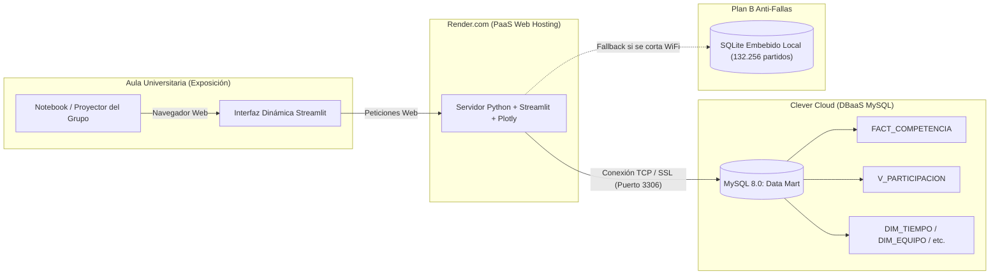

# Manual Integral: Dashboard Dinámico en Render y Clever Cloud MySQL
## Exposición y Defensa Oral de la Entrega Final — Metodología HEFESTO v2

Este documento constituye la guía maestra para el grupo sobre **cómo funciona, cómo se despliega y cómo se defiende frente a la cátedra** el Tablero Analítico Dinámico desarrollado para la Entrega Final.

---

## 1. Contexto y Objetivo de esta Implementación Dinámica

### ¿Por qué creamos este tablero dinámico?
El profesor solicitó que la defensa final se realice **al frente en clase a modo de exposición oral** y remarcó un requerimiento metodológico clave:
> *"El dashboard con las respuestas a las preguntas y los gráficos debe generarse de manera dinámica; es decir, debemos poder modificar las consultas o preguntas en plena exposición adaptándolas a requerimientos en vivo del docente y generar los gráficos en pantalla."*
> *Herramientas de referencia utilizadas por la cátedra: **Render** (servidor web) y **Clever Cloud** (base de datos MySQL en la nube).*

### Relación con los requerimientos crudos de la Entrega Final
- **Los entregables formales estáticos permanecen 100 % intactos** en la carpeta principal `entrega-final/`:
  - `dashboard.md`: documento formal exigido con las 12 preguntas, consultas fijas, tablas y figuras `.png`.
  - `generar_dashboard.py` y `dashboard.ipynb`: scripts y notebooks de validación local.
- **Esta subcarpeta (`dashboard-dinamico/`)** contiene la **solución de vanguardia interactiva** para proyectar en el aula, con capacidad de despliegue en la nube (Render + Clever Cloud) y soporte de contingencia offline.

---

## 2. Arquitectura de la Solución en la Nube

El siguiente diagrama ilustra cómo interactúan los componentes en la arquitectura solicitada por el docente:



### Componentes y sus roles:
1. **Clever Cloud (Base de Datos en la Nube):**
   - Servicio europeo de *Database as a Service (DBaaS)*.
   - Aloja el Data Mart multidimensional (`FACT_COMPETENCIA`, `DIM_TIEMPO`, `DIM_EQUIPO`, `DIM_DIVISION`, `DIM_PAIS` y la vista `V_PARTICIPACION`).
   - Evita la necesidad de que la computadora de la exposición deba tener MySQL Server corriendo localmente.
2. **Render (Servidor Web de la Aplicación):**
   - Plataforma de *Platform as a Service (PaaS)* conectada directamente a GitHub.
   - Ejecuta la aplicación Python con **Streamlit** y la publica bajo una URL HTTPS segura (ej: `https://tu-dashboard-futbol.onrender.com`).
3. **Streamlit + Plotly (Capa de Visualización Dinámica):**
   - Permite modificar sliders, selectores de clubes, rangos de años y ver la consulta SQL modificándose en vivo.
   - Genera gráficos interactivos con zoom, hover (tooltips con datos detallados) y exportación directa.
4. **Modo Contingencia Offline (Respaldo Anti-Fallas):**
   - Un motor SQLite embebido que contiene exactamente los mismos **132.256 partidos**, tablas, vistas e índices que MySQL. Si el WiFi del aula se corta o el proyector no tiene acceso a internet, la aplicación conmuta con un solo clic y sigue funcionando al 100 %.

---

## 3. Inventario de Archivos en `dashboard-dinamico/`

| Archivo | Rol y Función |
| :--- | :--- |
| **`app.py`** | **Aplicación principal de Streamlit**: contiene la interfaz de usuario, los 3 modos de trabajo (12 preguntas dinámicas, consola SQL en vivo y explorador del Data Mart), los controles interactivos y el renderizado de gráficos. |
| **`consultas_base.py`** | **Catálogo analítico**: almacena las 12 preguntas de negocio oficiales de HEFESTO, generadores dinámicos de SQL parametrizados, plantillas de preguntas sorpresa y el diccionario de datos de las tablas. |
| **`conexion.py`** | **Motor de conectividad resiliente**: gestiona conexiones a Clever Cloud MySQL, MySQL local y SQLite de contingencia, con medición de latencia y manejo de errores. |
| **`migrar_a_clevercloud.py`** | **Script de carga automática a la nube**: toma los datos y crea las tablas, vista `V_PARTICIPACION` e inserta los 132.256 partidos en la base de Clever Cloud en lotes. |
| **`exportar_dump_sql.py`** | **Generador de script SQL autónomo**: genera `dump_dw_clevercloud.sql` compatible con phpMyAdmin o DBeaver para importar con un clic en Clever Cloud. |
| **`generar_sqlite_contingencia.py`**| **Constructor del respaldo offline**: compila `dw_contingencia.sqlite` desde los datos de Paso 4 para garantizar que la app funcione sin conexión. |
| **`requirements.txt`** | **Dependencias cloud**: librerías requeridas en Render (`streamlit`, `pandas`, `plotly`, `mysql-connector-python`, `sqlalchemy`, `matplotlib`). |
| **`render.yaml`** | **Especificación de infraestructura (IaC)** para despliegue automatizado en Render con variables de entorno. |
| **`Procfile`** | Comando de inicio estándar para servidores PaaS. |
| **`.streamlit/config.toml`** | Configuración de servidor headless y paleta visual profesional en modo oscuro. |

---

## 4. Guía Paso a Paso: Configurar Clever Cloud (MySQL en la Nube)

Clever Cloud ofrece instancias MySQL gratuitas (plan Sandbox / Personal) ideales para proyectos universitarios.

### Paso 4.1: Crear la Base de Datos en Clever Cloud
1. Entrar a [clever-cloud.com](https://www.clever-cloud.com/) y registrarse / iniciar sesión.
2. En la consola principal, hacer clic en **"Create"** $\rightarrow$ **"an add-on"**.
3. Seleccionar **"MySQL"**.
4. Elegir el plan **"Dev / Free"** (gratuito) y seleccionar la región más cercana (ej: París o Montreal).
5. Asignar un nombre a la base (ej: `bda-dw-futbol`) y confirmar.
6. Una vez creada, Clever Cloud mostrará el panel **"Configuration & Connection Info"** con los siguientes datos:
   - **Host** (ej: `bxxxxxxxx-mysql.services.clever-cloud.com`)
   - **Port** (generalmente `3306`)
   - **Database Name** (ej: `b8qxxxxxxxx`)
   - **User** (ej: `uxxxxxxxxx`)
   - **Password** (una cadena alfanumérica segura)

> [!IMPORTANT]
> **Detalle crítico sobre Clever Cloud:** En la capa gratuita, Clever Cloud no te da permisos de superusuario `root`, por lo que **no se puede ejecutar `CREATE DATABASE` ni `USE`**. La base de datos ya viene creada con el nombre asignado (ej: `b8qxxxxxxxx`).  
> **Nuestros scripts (`migrar_a_clevercloud.py` y `exportar_dump_sql.py`) ya están diseñados teniendo esto en cuenta:** se conectan directamente a tu base asignada sin sentencias conflictivas.

### Paso 4.2: Cargar el Data Mart en Clever Cloud
Hay dos métodos sencillos. El grupo puede usar cualquiera:

#### Método A: Carga Automática con Python (Recomendado)
Desde la terminal, ejecutar:
```powershell
python migrar_a_clevercloud.py --host <TU_HOST> --user <TU_USUARIO> --password <TU_PASSWORD> --database <TU_DATABASE>
```
El script creará las tablas de dimensiones, la tabla de hechos, insertará los registros en lotes y creará la vista `V_PARTICIPACION` automáticamente.

#### Método B: Importación vía phpMyAdmin
1. En Clever Cloud, en la pestaña del add-on MySQL, hacer clic en el botón **"phpMyAdmin"**.
2. En tu computadora, generar el dump ejecutando:
   ```powershell
   python exportar_dump_sql.py
   ```
   Esto creará el archivo `dump_dw_clevercloud.sql`.
3. En phpMyAdmin, ir a la pestaña **"Importar"**, seleccionar `dump_dw_clevercloud.sql` y presionar **Continuar**.

---

## 5. Guía Paso a Paso: Desplegar el Dashboard en Render

Render permite desplegar aplicaciones web en Python de forma 100 % gratuita.

### Paso 5.1: Subir el proyecto a GitHub
Asegurarse de que el repositorio de GitHub contenga los cambios de la carpeta `entrega-final/dashboard-dinamico/`.

### Paso 5.2: Crear el Web Service en Render
1. Ingresar a [render.com](https://render.com/) e iniciar sesión con tu cuenta de GitHub.
2. Hacer clic en **"New +"** $\rightarrow$ **"Web Service"**.
3. Seleccionar el repositorio del proyecto.
4. Completar los campos de configuración:
   - **Name:** `bda-dashboard-futbol` (o el nombre que prefieran).
   - **Language / Environment:** `Python 3`.
   - **Region:** `Frankfurt` o `Oregon`.
   - **Branch:** `main` (o la rama correspondiente).
   - **Root Directory:** (dejar en blanco o colocar `entrega-final/dashboard-dinamico`).
   - **Build Command:**
     ```bash
     pip install -r entrega-final/dashboard-dinamico/requirements.txt
     ```
   - **Start Command:**
     ```bash
     cd entrega-final/dashboard-dinamico && streamlit run app.py --server.port $PORT --server.address 0.0.0.0 --server.headless true
     ```
   - **Instance Type:** `Free`.

### Paso 5.3: Configurar las Variables de Entorno en Render
En la misma pantalla (sección **Environment Variables**), agregar las 5 credenciales obtenidas de Clever Cloud:
- `MYSQL_HOST`: el host de Clever Cloud.
- `MYSQL_PORT`: `3306`.
- `MYSQL_USER`: tu usuario de Clever Cloud.
- `MYSQL_PASSWORD`: tu contraseña de Clever Cloud.
- `MYSQL_DATABASE`: el nombre de la base de datos de Clever Cloud.

5. Hacer clic en **"Deploy Web Service"**.
6. En 2-3 minutos, Render compilará la app y entregará una URL pública activa (ej: `https://bda-dashboard-futbol.onrender.com`).

---

## 6. Cómo Ejecutarlo en Local (En tu Computadora)

Si quieren practicar la exposición en sus casas o llevar la app lista en la notebook:

1. Abrir una terminal en `entrega-final/dashboard-dinamico/`.
2. Instalar dependencias (si no están instaladas):
   ```powershell
   python -m pip install -r requirements.txt
   ```
3. Iniciar Streamlit:
   ```powershell
   streamlit run app.py
   ```
4. Se abrirá automáticamente en tu navegador en `http://localhost:8501`.

---

## 7. Estrategia y Guión para la Exposición Oral en Clase (Frente al Docente)

Esta sección es un **guión táctico** para cuando el grupo esté al frente en el aula proyectando la pantalla.

### 🎤 Introducción (Minuto 0 a 1): Puesta en Contexto
1. **Saludo y encuadre metodológico:**
   > *"Buenas tardes profesor y compañeros. Presentamos la Entrega Final de la asignatura basada en la metodología HEFESTO v2. Construimos un Data Mart centrado en el proceso de **Competencia entre Equipos**, compuesto por la tabla de hechos `FACT_COMPETENCIA`, sus cuatro dimensiones conformadas (`DIM_TIEMPO`, `DIM_EQUIPO`, `DIM_DIVISION`, `DIM_PAIS`) y la vista analítica `V_PARTICIPACION`."*
2. **Mención de la arquitectura tecnológica:**
   > *"Siguiendo las pautas de cátedra, desplegamos nuestra arquitectura en la nube: la base de datos MySQL está alojada en **Clever Cloud**, el backend web corre sobre **Render**, y el frontend analítico está desarrollado en **Streamlit con Plotly** para permitir interacción en tiempo real."*

---

### 📊 Demostración de las 6 Preguntas Oficiales (Minutos 2 a 5)
Recorrer las preguntas de negocio oficiales y **destacar el panel de múltiples gráficos por pregunta**:

#### Caso A: Pregunta 1 (Evolución de Elo — Nottingham Forest)
- **KPIs y Gráficos:** Muestra la curva de Elo promedio anual con banda de rango min-max, el desglose de partidos disputados y la volatilidad anual. Nottingham Forest subió +314 puntos (+21,4 %).
- **Acción dinámica en vivo:**
  > *"Si quisiéramos evaluar a otro equipo, como por ejemplo **Arsenal** o **Real Madrid**, simplemente cambiamos el nombre en el selector..."*
- Escribir `Arsenal` o cambiar el slider de años. La curva, la banda min-max y los partidos se recalculan al instante.

#### Caso B: Pregunta 2 (Historial de Clásicos)
- **Gráficos:** Barras apiladas de % victorias/empates y volumen histórico de partidos por clásico.
- **Acción dinámica en vivo:** Activar el checkbox **"Comparar enfrentamiento libre entre 2 clubes"** y elegir `Liverpool` vs `Chelsea` para ver el gráfico de dona de resultados directos.

#### Caso C: Pregunta 3 (Ventaja de Localía)
- **Gráficos:** Ranking de ventaja neta (+16,9 pp promedio), dona continental (45 % local vs 28,1 % visitante) y comparativa de goles local vs visitante por liga.

#### Caso D: Pregunta 4 (Paridad de Ligas)
- **Gráficos:** Ranking de desvío de brecha Elo (menor = más pareja), comparativa de % de empates y el cuadrante de paridad (brecha Elo media vs empates), demostrando la paridad de las segundas divisiones.

#### Caso E: Pregunta 5 (Disciplina y Tarjetas por Liga)
- **Gráficos:** Ranking de amarillas, ranking de rojas y matriz de fricción disciplinaria (mostrando el clúster ibérico con >5 tarjetas por partido frente al fútbol inglés y alemán con ~3).

#### Caso F: Pregunta 6 (Mejores Visitantes en 5 Años)
- **Gráficos:** Ranking Top 15 de efectividad a domicilio (Porto 71,8 %, PSV 70,9 %, Celtic 70,7 %), balance goleador visitante y matriz de efectividad.

---

### 🚀 El "Momento Decisivo": Modificación de Consultas SQL en Vivo
Para cumplir con la consigna de *"poder modificar las consultas o preguntas en la exposición adaptándolas a preguntas que nos pueda hacer el profe"*:

1. En cualquiera de las 12 preguntas, tildar el casillero:
   `[✓] ✏️ Modificar consulta SQL en vivo (para consignas del profesor)`.
2. Se abrirá el editor de código SQL.
3. Explicar:
   > *"Toda la información se consulta exclusivamente contra el modelo estrella (`V_PARTICIPACION` o `FACT_COMPETENCIA`), nunca contra el CSV crudo. Si el profesor nos pide agregar una condición adicional, por ejemplo filtrar solo partidos jugados a partir de 2024 o excluir empates, lo podemos hacer directamente en el código."*
4. Modificar una línea de SQL (por ejemplo cambiar `LIMIT 15` por `LIMIT 5`, o agregar `AND p.puntos = 3`), presionar **"🚀 Ejecutar Consulta"** y ver cómo la tabla y el gráfico se adaptan al instante.

---

### 💻 Consola SQL en Vivo: Para Preguntas Sorpresa del Docente
Si en medio de la defensa el profesor dice:
> *"A ver, ¿y cómo harían una consulta para ver cuáles fueron los 10 partidos con más goles de toda la historia del Data Mart?"*
o *"Quiero ver qué liga tuvo mayor cantidad de empates en 2023"*.

**Cómo actuar:**
1. En la barra lateral, cambiar al modo:
   **`💻 Consola SQL en Vivo (Preguntas del Profesor)`**.
2. Desplegar el **"📖 Diccionario de Tablas del DW"** para tener a la vista los nombres exactos de columnas (`goles_local`, `id_division`, `resultado`, etc.).
3. Si la pregunta coincide con una de las plantillas frecuentes, seleccionarla en el dropdown **"Plantillas Rápidas"** y hacer clic en **"Cargar Plantilla al Editor"**.
4. Si es una consulta libre nueva, escribirla en el editor.
5. Presionar **"▶ Ejecutar Consulta Libre"**.
6. En la parte inferior, utilizar el **Generador Rápido de Gráficos** eligiendo el eje X, eje Y y tipo de gráfico (Barras, Líneas, Dona). ¡El gráfico se generará frente al docente en segundos!

---

### 🛡️ Plan de Contingencia (Si se cae el WiFi de la Facultad)
Uno de los problemas más comunes en defensas universitarias es que la red WiFi del aula falle, tenga bloqueos o no permita conexiones salientes por el puerto 3306.

**Cómo resolverlo con total tranquilidad:**
1. En la barra lateral (`st.sidebar`), en **"Origen de Datos"**, cambiar de `☁️ Clever Cloud MySQL` a:
   **`🛡️ Contingencia Offline (SQLite Local)`**.
2. La aplicación conmutará inmediatamente a la base local compilada `dw_contingencia.sqlite` (que tiene los mismos **132.256 partidos**, tablas y vistas).
3. Todo el tablero seguirá funcionando al 100 % sin depender de internet.
4. Mención para la cátedra:
   > *"Como buena práctica de ingeniería de software para despliegues de misión crítica, implementamos un patrón de respaldo resiliente: la aplicación detecta y permite conmutar en caliente entre la nube de Clever Cloud y un motor local de contingencia."*

---

## 8. Resumen de Respuestas Clave ante Posibles Preguntas del Profesor

| Pregunta Típica del Profesor | Respuesta Metodológica Correcta |
| :--- | :--- |
| **¿Por qué las consultas no van contra el archivo CSV?** | Porque según HEFESTO v2, una vez validado el Data Warehouse, la explotación analítica debe realizarse **estrictamente sobre el modelo multidimensional** para aprovechar la granularidad, las claves foráneas consolidadas y las dimensiones conformadas. |
| **¿Qué es `V_PARTICIPACION` y por qué no altera el modelo físico?** | Es una vista lógica creada sobre `FACT_COMPETENCIA` que proyecta cada partido dos veces (una como local y otra como visitante). Permite calcular métricas por club con un simple `GROUP BY equipo` sin duplicar almacenamiento físico ni romper la clave primaria compuesta del hecho. |
| **¿Por qué algunas ligas tienen valores nulos en tarjetas o Elo?** | Porque en la fuente original ciertas ligas menores no registran tarjetas o no calculaban Elo. En el ETL de Paso 4 se decidió **no imputar 0** en tarjetas para no distorsionar los promedios reales de las ligas con registro disciplinario verificado. |
| **¿Qué pasó con `EloRatings.csv`?** | Se auditó en el Paso 2 y se comprobó que `Matches.csv` ya contenía el Elo atómico de cada partido (`HomeElo` y `AwayElo`) con 100 % de cobertura en las ligas del alcance, por lo que no fue necesario cargarlo en MySQL, evitando uniones redundantes. |
