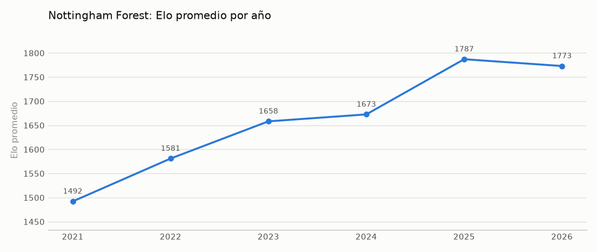
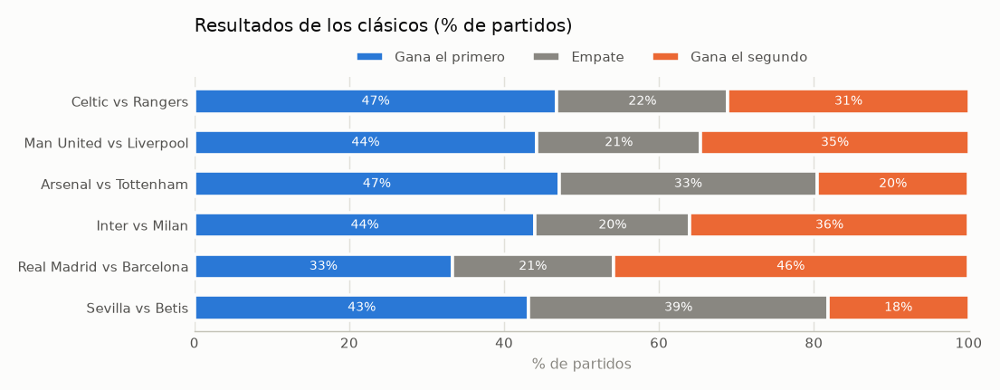
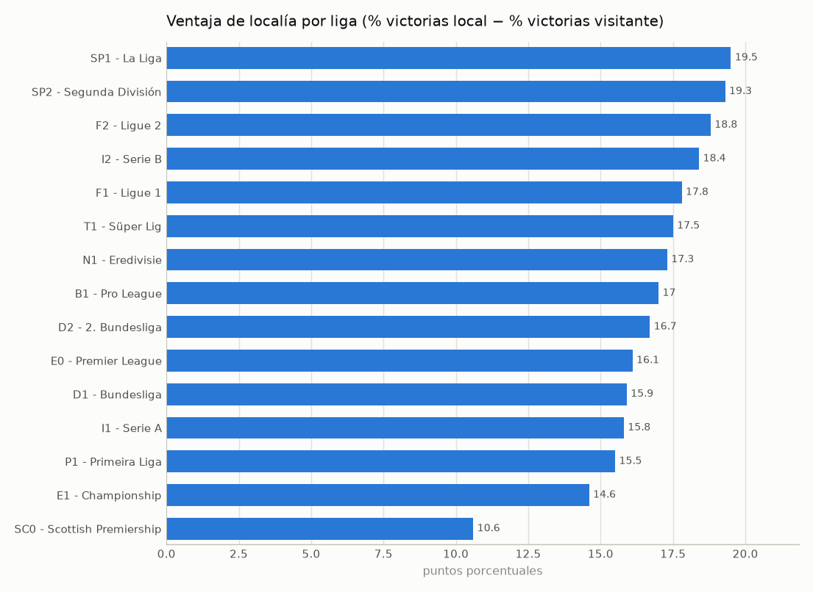
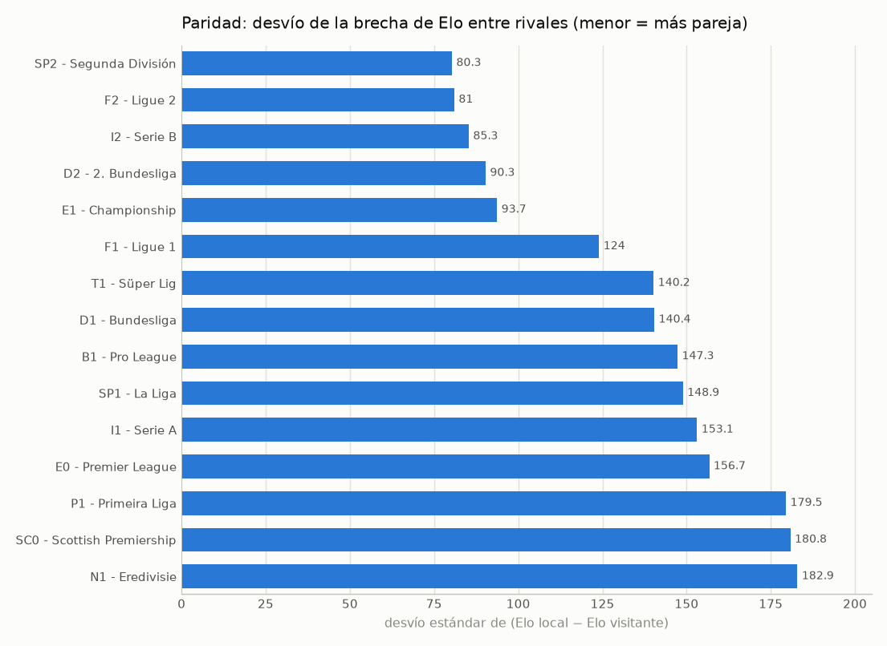
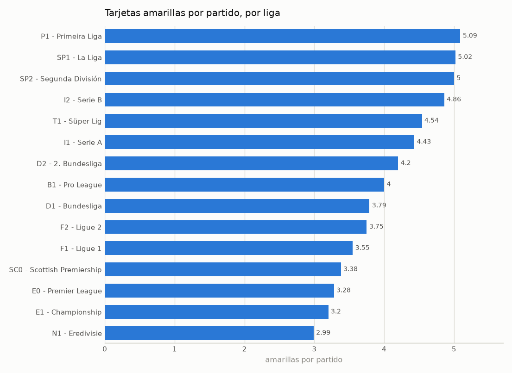
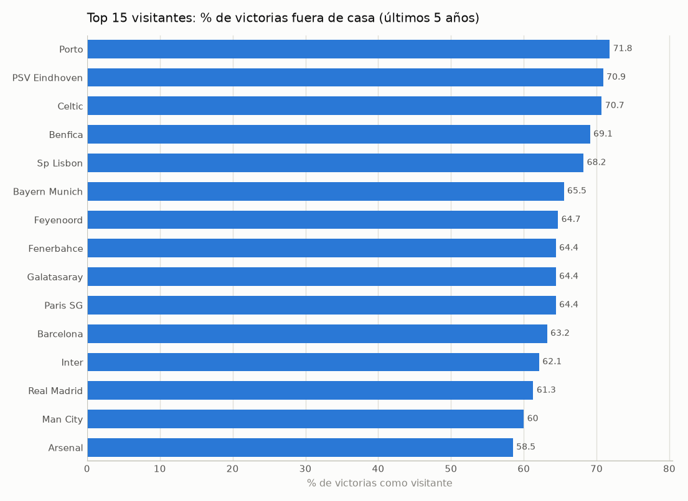

# Dashboard — Competencia entre Equipos

Cada pregunta de negocio del Paso 1 se responde con una consulta SQL sobre el modelo estrella `dw_competencia_futbol` (`FACT_COMPETENCIA` + dimensiones), nunca sobre el archivo original. Los resultados y gráficos se generan con `generar_dashboard.py`.

Para los indicadores "por equipo" se usa la vista `V_PARTICIPACION` (`sql/07_vista_dashboard.sql`), construida solo con `FACT_COMPETENCIA`: presenta cada partido dos veces, una desde el punto de vista de cada equipo, para no repetir el `CASE` local/visitante en todas las consultas.

Alcance: 15 ligas europeas de 10 países (E0, E1, SP1, SP2, I1, I2, D1, D2, F1, F2, N1, P1, B1, T1, SC0), todas con temporada de julio a junio y datos de 2000 a 2026. Las ventanas "últimos N años" se calculan desde la última fecha cargada en `DIM_TIEMPO` (2026-09-03).

## 1. ¿Cuánto mejoró un equipo específico en 5 años? (ejemplo: Nottingham Forest)

**Indicadores:** Evolución de Elo — Perspectivas: Equipo, Tiempo

**Consulta 1:**

```sql
SELECT t.anio,
       ROUND(AVG(p.elo), 1) AS elo_promedio,
       ROUND(MIN(p.elo), 1) AS elo_minimo,
       ROUND(MAX(p.elo), 1) AS elo_maximo,
       COUNT(*)             AS partidos
FROM V_PARTICIPACION p
JOIN DIM_EQUIPO e ON e.id_equipo = p.id_equipo
JOIN DIM_TIEMPO t ON t.id_tiempo = p.id_tiempo
WHERE e.nombre_equipo = 'Nottm Forest'
  AND p.elo IS NOT NULL
  AND t.fecha >= (SELECT MAX(fecha) FROM DIM_TIEMPO) - INTERVAL 5 YEAR
GROUP BY t.anio
ORDER BY t.anio
```

**Resultado:**

| anio | elo_promedio | elo_minimo | elo_maximo | partidos |
| --- | --- | --- | --- | --- |
| 2021 | 1492.1 | 1456.7 | 1526.9 | 20 |
| 2022 | 1581 | 1510.4 | 1629.3 | 37 |
| 2023 | 1658.2 | 1624.8 | 1687.4 | 42 |
| 2024 | 1672.6 | 1638.6 | 1731.5 | 35 |
| 2025 | 1787.1 | 1758.3 | 1813.9 | 38 |
| 2026 | 1773 | 1752.2 | 1799.3 | 21 |

**Consulta 2:**

```sql
WITH v AS (
    SELECT t.fecha, p.elo
    FROM V_PARTICIPACION p
    JOIN DIM_EQUIPO e ON e.id_equipo = p.id_equipo
    JOIN DIM_TIEMPO t ON t.id_tiempo = p.id_tiempo
    WHERE e.nombre_equipo = 'Nottm Forest'
      AND p.elo IS NOT NULL
      AND t.fecha >= (SELECT MAX(fecha) FROM DIM_TIEMPO) - INTERVAL 5 YEAR
), extremos AS (SELECT MIN(fecha) AS f0, MAX(fecha) AS f1 FROM v)
SELECT i.fecha AS fecha_inicial, i.elo AS elo_inicial,
       f.fecha AS fecha_final,   f.elo AS elo_final,
       ROUND(f.elo - i.elo, 1)               AS variacion,
       ROUND(100 * (f.elo - i.elo) / i.elo, 1) AS pct_crecimiento
FROM extremos x
JOIN v i ON i.fecha = x.f0
JOIN v f ON f.fecha = x.f1
```

**Resultado:**

| fecha_inicial | elo_inicial | fecha_final | elo_final | variacion | pct_crecimiento |
| --- | --- | --- | --- | --- | --- |
| 2021-09-12 | 1466.29 | 2026-08-29 | 1780.39 | 314.1 | 21.4 |



**Respuesta:** Nottingham Forest pasó de 1466 puntos de Elo (septiembre de 2021, en Championship) a 1780 (agosto de 2026): +314 puntos, un 21,4 % de crecimiento. El mayor salto fue entre 2024 y 2025.

---

## 2. ¿Qué equipo tiende a ganar más contra otro según su historial? (clásicos)

**Indicadores:** % de victorias en enfrentamientos directos — Perspectivas: Equipo, Rival

```sql
WITH clasicos AS (
    SELECT 'Real Madrid' AS equipo_a, 'Barcelona' AS equipo_b
    UNION ALL SELECT 'Arsenal', 'Tottenham'
    UNION ALL SELECT 'Sevilla', 'Betis'
    UNION ALL SELECT 'Man United', 'Liverpool'
    UNION ALL SELECT 'Celtic', 'Rangers'
    UNION ALL SELECT 'Inter', 'Milan'
)
SELECT CONCAT(c.equipo_a, ' vs ', c.equipo_b)     AS clasico,
       COUNT(*)                                     AS partidos,
       SUM(p.victoria)                              AS gana_a,
       SUM(p.empate)                                AS empates,
       SUM(p.derrota)                               AS gana_b,
       ROUND(100 * SUM(p.victoria) / COUNT(*), 1)   AS pct_gana_a,
       ROUND(100 * SUM(p.empate) / COUNT(*), 1)     AS pct_empate,
       ROUND(100 * SUM(p.derrota) / COUNT(*), 1)    AS pct_gana_b
FROM clasicos c
JOIN DIM_EQUIPO ea ON ea.nombre_equipo = c.equipo_a
JOIN DIM_EQUIPO eb ON eb.nombre_equipo = c.equipo_b
JOIN V_PARTICIPACION p ON p.id_equipo = ea.id_equipo AND p.id_rival = eb.id_equipo
GROUP BY c.equipo_a, c.equipo_b
ORDER BY partidos DESC
```

**Resultado:**

| clasico | partidos | gana_a | empates | gana_b | pct_gana_a | pct_empate | pct_gana_b |
| --- | --- | --- | --- | --- | --- | --- | --- |
| Celtic vs Rangers | 77 | 36 | 17 | 24 | 46.8 | 22.1 | 31.2 |
| Man United vs Liverpool | 52 | 23 | 11 | 18 | 44.2 | 21.2 | 34.6 |
| Arsenal vs Tottenham | 51 | 24 | 17 | 10 | 47.1 | 33.3 | 19.6 |
| Inter vs Milan | 50 | 22 | 10 | 18 | 44 | 20 | 36 |
| Real Madrid vs Barcelona | 48 | 16 | 10 | 22 | 33.3 | 20.8 | 45.8 |
| Sevilla vs Betis | 44 | 19 | 17 | 8 | 43.2 | 38.6 | 18.2 |



**Respuesta:** Arsenal domina a Tottenham (gana el 47 % contra el 20 %) y Sevilla a Betis (43 % vs 18 %); Celtic a Rangers (47 % vs 31 %), Man United a Liverpool (44 % vs 35 %) e Inter a Milan (44 % vs 36 %). En el clásico español gana más Barcelona (46 % vs 33 %).

---

## 3. ¿Existe ventaja de local?

**Indicadores:** Ventaja de localía, Promedio de goles a favor / en contra — Perspectivas: División

**Consulta 1:**

```sql
SELECT COUNT(*)                                   AS partidos,
       ROUND(100 * AVG(victoria_local), 1)        AS pct_gana_local,
       ROUND(100 * AVG(empate), 1)                AS pct_empate,
       ROUND(100 * AVG(victoria_visitante), 1)    AS pct_gana_visitante,
       ROUND(AVG(goles_local), 2)                 AS goles_local_prom,
       ROUND(AVG(goles_visitante), 2)             AS goles_visitante_prom
FROM FACT_COMPETENCIA
```

**Resultado:**

| partidos | pct_gana_local | pct_empate | pct_gana_visitante | goles_local_prom | goles_visitante_prom |
| --- | --- | --- | --- | --- | --- |
| 132256 | 45 | 26.9 | 28.1 | 1.50 | 1.14 |

**Consulta 2:**

```sql
SELECT CONCAT(d.codigo_division, ' - ', d.nombre_liga)                     AS liga,
       COUNT(*)                                                              AS partidos,
       ROUND(100 * AVG(f.victoria_local), 1)                                 AS pct_local,
       ROUND(100 * AVG(f.victoria_visitante), 1)                             AS pct_visitante,
       ROUND(100 * (AVG(f.victoria_local) - AVG(f.victoria_visitante)), 1)  AS ventaja_pp,
       ROUND(AVG(f.goles_local) - AVG(f.goles_visitante), 2)                 AS dif_goles
FROM FACT_COMPETENCIA f
JOIN DIM_DIVISION d ON d.id_division = f.id_division
GROUP BY d.id_division, d.codigo_division, d.nombre_liga
ORDER BY ventaja_pp DESC
```

**Resultado:**

| liga | partidos | pct_local | pct_visitante | ventaja_pp | dif_goles |
| --- | --- | --- | --- | --- | --- |
| SP1 - La Liga | 9419 | 47.2 | 27.6 | 19.5 | 0.42 |
| SP2 - Segunda División | 10992 | 44.7 | 25.4 | 19.3 | 0.36 |
| F2 - Ligue 2 | 9018 | 44.2 | 25.4 | 18.8 | 0.35 |
| I2 - Serie B | 10321 | 43.2 | 24.8 | 18.4 | 0.34 |
| F1 - Ligue 1 | 9081 | 45 | 27.2 | 17.8 | 0.37 |
| T1 - Süper Lig | 7791 | 46.2 | 28.7 | 17.5 | 0.36 |
| N1 - Eredivisie | 7627 | 46.9 | 29.6 | 17.3 | 0.45 |
| B1 - Pro League | 6906 | 46 | 29.1 | 17 | 0.39 |
| D2 - 2. Bundesliga | 7494 | 44.9 | 28.2 | 16.7 | 0.36 |
| E0 - Premier League | 9810 | 45.7 | 29.6 | 16.1 | 0.35 |
| D1 - Bundesliga | 7837 | 45.6 | 29.7 | 15.9 | 0.39 |
| I1 - Serie A | 9412 | 44.4 | 28.6 | 15.8 | 0.32 |
| P1 - Primeira Liga | 6965 | 45.1 | 29.6 | 15.5 | 0.32 |
| E1 - Championship | 14206 | 43.7 | 29.1 | 14.6 | 0.31 |
| SC0 - Scottish Premiership | 5377 | 43.4 | 32.7 | 10.6 | 0.28 |



**Respuesta:** Sí. En total el local gana el 45,0 % de los partidos contra el 28,1 % del visitante (+16,9 puntos porcentuales) y convierte 1,50 goles contra 1,14. La ventaja es mayor en La Liga (19,5 pp) y menor en la Premiership escocesa (10,6 pp).

---

## 4. ¿Qué liga es más pareja?

**Indicadores:** Paridad de la liga — Perspectivas: División, Tiempo

> Solo ligas con Elo en al menos el 80 % de sus partidos (en el resto el indicador no es representativo).

```sql
SELECT CONCAT(d.codigo_division, ' - ', d.nombre_liga)            AS liga,
       COUNT(*)                                                     AS partidos,
       SUM(f.elo_local IS NOT NULL AND f.elo_visitante IS NOT NULL) AS partidos_con_elo,
       ROUND(STDDEV_SAMP(f.elo_local - f.elo_visitante), 1)         AS desvio_brecha_elo,
       ROUND(AVG(ABS(f.elo_local - f.elo_visitante)), 1)            AS brecha_elo_media,
       ROUND(100 * AVG(f.empate), 1)                                AS pct_empates
FROM FACT_COMPETENCIA f
JOIN DIM_DIVISION d ON d.id_division = f.id_division
GROUP BY d.id_division, d.codigo_division, d.nombre_liga
HAVING partidos_con_elo >= 0.8 * partidos
ORDER BY desvio_brecha_elo
```

**Resultado:**

| liga | partidos | partidos_con_elo | desvio_brecha_elo | brecha_elo_media | pct_empates |
| --- | --- | --- | --- | --- | --- |
| SP2 - Segunda División | 10992 | 10324 | 80.3 | 64.3 | 30 |
| F2 - Ligue 2 | 9018 | 8827 | 81.0 | 64.9 | 30.4 |
| I2 - Serie B | 10321 | 10278 | 85.3 | 66.5 | 31.9 |
| D2 - 2. Bundesliga | 7494 | 7410 | 90.3 | 72.8 | 26.9 |
| E1 - Championship | 14206 | 13940 | 93.7 | 75 | 27.2 |
| F1 - Ligue 1 | 9081 | 9043 | 124.0 | 95.3 | 27.7 |
| T1 - Süper Lig | 7791 | 6746 | 140.2 | 110.6 | 25.1 |
| D1 - Bundesliga | 7837 | 7837 | 140.4 | 109.1 | 24.7 |
| B1 - Pro League | 6906 | 6155 | 147.3 | 119.3 | 24.9 |
| SP1 - La Liga | 9419 | 9419 | 148.9 | 112.2 | 25.2 |
| I1 - Serie A | 9412 | 9412 | 153.1 | 121.2 | 27 |
| E0 - Premier League | 9810 | 9808 | 156.7 | 124.1 | 24.7 |
| P1 - Primeira Liga | 6965 | 6894 | 179.5 | 135.1 | 25.3 |
| SC0 - Scottish Premiership | 5377 | 4938 | 180.8 | 135.1 | 23.9 |
| N1 - Eredivisie | 7627 | 7085 | 182.9 | 146.1 | 23.4 |



**Respuesta:** Las segundas divisiones son las más parejas (Segunda División, Ligue 2 y Serie B: desvío de ~80-85 puntos de Elo y ~30 % de empates). Entre las primeras divisiones la más pareja es la Ligue 1; las menos parejas son la Eredivisie, la Premiership escocesa y la Primeira Liga.

---

## 5. ¿Qué liga acumula más tarjetas?

**Indicadores:** Promedio de tarjetas amarillas y rojas — Perspectivas: División, País

> Solo partidos con dato de tarjetas (las ligas sin ese dato no se promedian como 0).

```sql
SELECT CONCAT(d.codigo_division, ' - ', d.nombre_liga)            AS liga,
       pa.nombre_pais                                               AS pais,
       COUNT(f.amarillas_local)                                     AS partidos_con_dato,
       ROUND(AVG(f.amarillas_local + f.amarillas_visitante), 2)     AS amarillas_x_partido,
       ROUND(AVG(f.rojas_local + f.rojas_visitante), 3)             AS rojas_x_partido
FROM FACT_COMPETENCIA f
JOIN DIM_DIVISION d ON d.id_division = f.id_division
JOIN DIM_PAIS pa    ON pa.id_pais = f.id_pais
GROUP BY d.id_division, d.codigo_division, d.nombre_liga, pa.nombre_pais
HAVING partidos_con_dato >= 1000
ORDER BY amarillas_x_partido DESC
```

**Resultado:**

| liga | pais | partidos_con_dato | amarillas_x_partido | rojas_x_partido |
| --- | --- | --- | --- | --- |
| P1 - Primeira Liga | Portugal | 2787 | 5.09 | 0.292 |
| SP1 - La Liga | España | 7631 | 5.02 | 0.289 |
| SP2 - Segunda División | España | 4170 | 5 | 0.262 |
| I2 - Serie B | Italia | 3482 | 4.86 | 0.256 |
| T1 - Süper Lig | Turquía | 3057 | 4.54 | 0.253 |
| I1 - Serie A | Italia | 7998 | 4.43 | 0.265 |
| D2 - 2. Bundesliga | Alemania | 3697 | 4.20 | 0.204 |
| B1 - Pro League | Bélgica | 2596 | 4 | 0.228 |
| D1 - Bundesliga | Alemania | 7547 | 3.79 | 0.173 |
| F2 - Ligue 2 | Francia | 3203 | 3.75 | 0.249 |
| F1 - Ligue 1 | Francia | 7674 | 3.55 | 0.239 |
| SC0 - Scottish Premiership | Escocia | 5377 | 3.38 | 0.205 |
| E0 - Premier League | Inglaterra | 9810 | 3.28 | 0.146 |
| E1 - Championship | Inglaterra | 14205 | 3.20 | 0.154 |
| N1 - Eredivisie | Países Bajos | 2713 | 2.99 | 0.171 |



**Respuesta:** La Primeira Liga (5,09 amarillas por partido), La Liga (5,02) y la Segunda División española (5,00). Portugal y España también encabezan las rojas (~0,29 por partido). Las ligas inglesas y la Eredivisie son las que menos acumulan (~3 amarillas).

---

## 6. ¿Qué equipos tienen mejor estadística de visitante? (últimos 5 años)

**Indicadores:** % de victorias y Promedio de goles a favor como visitante — Perspectivas: Equipo, División

```sql
SELECT e.nombre_equipo                        AS equipo,
       GROUP_CONCAT(DISTINCT d.codigo_division)  AS divisiones,
       COUNT(*)                                  AS partidos_visitante,
       ROUND(100 * AVG(p.victoria), 1)           AS pct_victorias,
       ROUND(AVG(p.goles_favor), 2)              AS goles_favor_prom,
       ROUND(AVG(p.goles_contra), 2)             AS goles_contra_prom
FROM V_PARTICIPACION p
JOIN DIM_EQUIPO e   ON e.id_equipo = p.id_equipo
JOIN DIM_DIVISION d ON d.id_division = p.id_division
JOIN DIM_TIEMPO t   ON t.id_tiempo = p.id_tiempo
WHERE p.condicion = 'Visitante'
  AND t.fecha >= (SELECT MAX(fecha) FROM DIM_TIEMPO) - INTERVAL 5 YEAR
GROUP BY e.id_equipo, e.nombre_equipo
HAVING partidos_visitante >= 60
ORDER BY pct_victorias DESC
LIMIT 15
```

**Resultado:**

| equipo | divisiones | partidos_visitante | pct_victorias | goles_favor_prom | goles_contra_prom |
| --- | --- | --- | --- | --- | --- |
| Porto | P1 | 85 | 71.8 | 1.81 | 0.76 |
| PSV Eindhoven | N1 | 86 | 70.9 | 2.63 | 1.17 |
| Celtic | SC0 | 92 | 70.7 | 2.36 | 1 |
| Benfica | P1 | 84 | 69.1 | 2.06 | 0.83 |
| Sp Lisbon | P1 | 85 | 68.2 | 2.31 | 0.94 |
| Bayern Munich | D1 | 84 | 65.5 | 2.71 | 1.29 |
| Feyenoord | N1 | 85 | 64.7 | 2.26 | 1.09 |
| Fenerbahce | T1 | 90 | 64.4 | 2.21 | 0.99 |
| Galatasaray | T1 | 90 | 64.4 | 1.99 | 0.92 |
| Paris SG | F1 | 87 | 64.4 | 2.25 | 0.98 |
| Barcelona | SP1 | 95 | 63.2 | 2.02 | 1.07 |
| Inter | I1 | 95 | 62.1 | 2.01 | 0.92 |
| Real Madrid | SP1 | 93 | 61.3 | 1.77 | 0.97 |
| Man City | E0 | 95 | 60 | 1.95 | 0.92 |
| Arsenal | E0 | 94 | 58.5 | 1.80 | 0.94 |



**Respuesta:** En los últimos 5 años, Porto (gana el 71,8 % de sus partidos como visitante), PSV (70,9 %) y Celtic (70,7 %). Entre las cinco grandes ligas, Bayern Munich (65,5 %), Paris SG y Barcelona.

