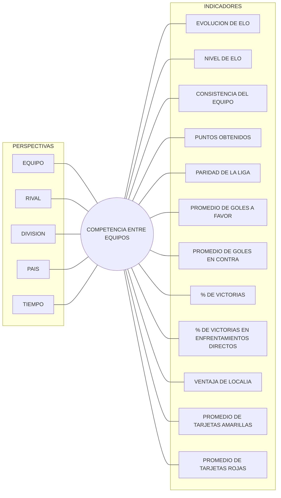

**PARTE 1:** 

1)  **Data set:**   
   [**https://www.kaggle.com/datasets/adamgbor/club-football-match-data-2000-2025?resource=download\&select=Matches.csv**](https://www.kaggle.com/datasets/adamgbor/club-football-match-data-2000-2025?resource=download&select=Matches.csv)  
     
- **Proceso de negocio a analizar:** la **competencia entre equipos** de fútbol, es decir, los partidos disputados entre clubes en sus ligas (cada partido es un evento que se repite y genera un registro).
- El dataset elegido contiene datos históricos de partidos de fútbol de clubes desde el 2000 hasta el 2026, principalmente de ligas europeas (e incluye también algunas ligas de América y Asia), junto con la evolución del puntaje Elo de los clubes.
- **Alcance del análisis:** el archivo trae 38 ligas, pero el análisis se acota a **15 ligas europeas de 10 países**: primera y segunda división de Inglaterra, España, Italia, Alemania y Francia, más la primera división de Países Bajos, Portugal, Bélgica, Turquía y Escocia. Son ligas comparables entre sí: todas se juegan de julio a junio, tienen datos de 2000 a 2026 y el puntaje Elo está disponible en casi todos sus partidos. Las demás ligas se dejan afuera porque cubren períodos más cortos, se juegan por año calendario o no tienen Elo, y mezclarlas haría injustas las comparaciones (el detalle se documenta en el Paso 2). El análisis del mismo se va a dar sobre atributos como fecha, equipo local, equipo visitante, goles, tiros, tarjetas, etc. para poder obtener datos derivados como goles de un equipo siendo visitante en los últimos tres partidos, o partidos donde se hicieron \+3 goles, etc. Todo esto para poder hacernos preguntas como: 

1) ¿Cuánto mejoró un equipo específico en 5 años? (elo)   
2) ¿Qué equipo tiende a ganar más contra otro según su historial? (ver clásicos)  
3) ¿Existe ventaja de local?  
4) ¿Qué liga es más pareja? (porque hay competencia, más vistas)   
5) ¿Qué liga acumula más tarjetas? (por liga y país)   
6) ¿Qué equipos tienen mejor estadística de visitante?  
7) ¿Cuál es el porcentaje de victorias? (equipo)  
8) ¿Cuál es el promedio de goles? (equipo)   
9) ¿El equipo es consistente a lo largo de los años? (si está en una misma liga, si sube o baja)  
10) ¿Cuáles son los equipos con mayor incremento de ELO en los últimos 3 años?   
11) ¿Cuáles son los equipos con mayor promedio de rojas? (por fair play)  
12) ¿Qué países tienen equipos con mayor elo?

	A partir de estas preguntas, se intenta emplear a un sponsor cualquiera, la capacidad de poder analizar métricas para la toma de decisiones en cuanto a dónde invertir, en qué equipo, y de qué forma. 

- INDICADORES Y PERSPECTIVAS POR PREGUNTAS:

> En este paso los indicadores se expresan solo a nivel conceptual (qué se quiere medir). La forma de calcular cada uno a partir de las columnas reales del archivo se define en el Paso 2 (a) Conformar indicadores y b) Establecer correspondencias).

### 3. Indicadores y Perspectivas por Pregunta

* **1 y 10. ¿Cuánto mejoró un equipo en 5 años? / Mayor incremento en 3 años**
  * **Indicadores:** Evolución de Elo.
  * **Perspectivas:** EQUIPO, TIEMPO.

* **9. ¿El equipo es consistente a lo largo de los años?**
  * **Indicadores:** Consistencia del equipo, Puntos obtenidos.
  * **Perspectivas:** EQUIPO, DIVISION, TIEMPO.

* **4. ¿Qué liga es más pareja?**
  * **Indicadores:** Paridad de la liga.
  * **Perspectivas:** DIVISION, TIEMPO.

* **8. ¿Cuál es el promedio de goles? (Atractivo ofensivo)**
  * **Indicadores:** Promedio de goles a favor.
  * **Perspectivas:** EQUIPO, DIVISION, TIEMPO.

* **7. ¿Cuál es el porcentaje de victorias general?**
  * **Indicadores:** % de victorias.
  * **Perspectivas:** EQUIPO, DIVISION, TIEMPO.

* **2. ¿Qué equipo tiende a ganar más contra otro? (Historial de clásicos)**
  * **Indicadores:** % de victorias en enfrentamientos directos.
  * **Perspectivas:** EQUIPO, RIVAL.

* **6. ¿Qué equipos tienen mejor estadística de visitante?**
  * **Indicadores:** % de victorias, Promedio de goles a favor (ambos en condición de visitante).
  * **Perspectivas:** EQUIPO, DIVISION.

* **3. ¿Existe ventaja de localía?**
  * **Indicadores:** Ventaja de localía, Promedio de goles a favor, Promedio de goles en contra.
  * **Perspectivas:** EQUIPO, DIVISION.

* **12. ¿Qué países tienen equipos con mayor ELO?**
  * **Indicadores:** Nivel de Elo.
  * **Perspectivas:** PAIS, EQUIPO, TIEMPO.

* **5 y 11. ¿Qué liga acumula más tarjetas? / ¿Equipos con mayor promedio de rojas?**
  * **Indicadores:** Promedio de tarjetas amarillas, Promedio de tarjetas rojas.
  * **Perspectivas:** EQUIPO, DIVISION, PAIS, TIEMPO.

**MODELO CONCEPTUAL**:

