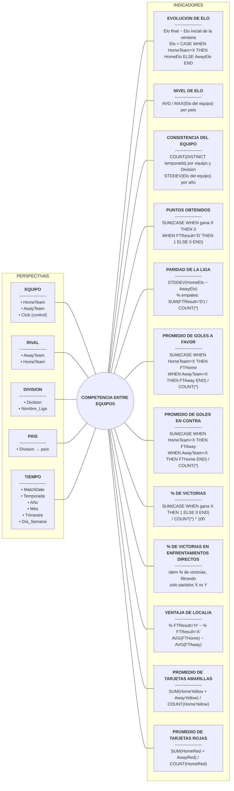

# Paso 2: Análisis de la Fuente de Datos (Metodología HEFESTO)

**Punto de partida:** el modelo conceptual y las preguntas de negocio de `entrega_requerimientos.md` (Paso 1).

Para el desarrollo del Data Warehouse se dispone del dataset *Club Football Match Data (2000-2025)*, integrado por dos archivos:
* **`Matches.csv` (Partidos):** Es la **fuente principal** para poblar el Data Warehouse (hechos y dimensiones). Contiene 48 columnas y 238.858 registros de partidos atómicos disputados entre 2000 y 2026.
* **`EloRatings.csv` (Clasificaciones Elo):** Es una **fuente auxiliar de control**, utilizada en este paso para el cotejo cruzado y la auditoría de consistencia de nombres de clubes. No se carga físicamente en el DW porque `Matches.csv` ya contiene las puntuaciones Elo por partido (`HomeElo`, `AwayElo`) y la dimensión geográfica se resuelve de forma determinista mediante el código de división.

---

### **TABLA 1 - Archivo Auxiliar de Control: `EloRatings.csv`**

| Columna | Tipo de datos | Descripción |
| :---- | :---- | :---- |
| **`Date`** | *fecha* | Fecha de la instantánea del ranking. |
| **`Club`** | *texto* | Nombre del club registrado en el escalafón Elo (se contrasta contra `Matches.csv`). |
| **`Country`** | *categoría* | Código de tres letras del país del club. |
| **`Elo`** | *decimal* | Clasificación Elo del club a dicha fecha, redondeada a dos decimales. |

### **TABLA 2 - Archivo Principal de Partidos: `Matches.csv` (48 columnas reales)**

| Columna | Tipo de datos | Descripción |
| :---- | :---- | :---- |
| **🏆`Division`** | *categoría* | Liga en la que se jugó el partido: código de país \+ número de división ( *I1 para la Primera División italiana* ). Para países donde solo tenemos una liga, usamos el código de país de 3 letras ( *ARG para Argentina* ). |
| **📆`MatchDate`** | *fecha* | Fecha del partido en el formato clásico AAAA-MM-DD. |
| **🕘`MatchTime`** | *hora* | Horario del partido en formato HH:MM:SS. Zona horaria CET-1. |
| **🏠`HomeTeam`** | *texto* | Nombre del club del equipo local en inglés, abreviado si es necesario. |
| **🚗`AwayTeam`** | *texto* | Nombre del club del equipo visitante en inglés, abreviado si es necesario. |
| **📊`HomeElo`** | *decimal* | La clasificación Elo más reciente del equipo local. |
| **📊`AwayElo`** | *decimal* | La clasificación Elo más reciente del equipo visitante. |
| **📉`Form3Home`** | *entero* | Número de puntos obtenidos por el equipo local en los últimos 3 partidos ( *Victoria \= 3 puntos, Empate \= 1 punto, Derrota \= 0 puntos, por lo que este valor está entre 0 y 9* ). |
| **📈`Form5Home`** | *entero* | Número de puntos obtenidos por el equipo local en los últimos 5 partidos ( *Victoria \= 3 puntos, Empate \= 1 punto, Derrota \= 0 puntos, por lo que este valor está entre 0 y 15* ). |
| **📉`Form3Away`** | *entero* | Número de puntos obtenidos por el equipo visitante en los últimos 3 partidos ( *Victoria \= 3 puntos, Empate \= 1 punto, Derrota \= 0 puntos, por lo que este valor está entre 0 y 9* ). |
| **📈`Form5Away`** | *entero* | Número de puntos obtenidos por el equipo visitante en los últimos 5 partidos ( *Victoria \= 3 puntos, Empate \= 1 punto, Derrota \= 0 puntos, por lo que este valor está entre 0 y 15* ). |
| **⚽`FTHome`** | *entero* | Goles anotados por el equipo local en el tiempo reglamentario. |
| **⚽`FTAway`** | *entero* | Goles anotados por el equipo visitante en el tiempo reglamentario. |
| **🏁`FTResult`** | *categoría* | Resultado final ( *H para victoria local, D para empate y A para victoria visitante* ). |
| **⚽`HTHome`** | *entero* | Goles anotados por el equipo local en el descanso. |
| **⚽`HTAway`** | *entero* | Goles marcados por el equipo visitante al descanso. |
| **⏱️`HTResult`** | *categoría* | Resultado al descanso ( *H para victoria local, D para empate y A para victoria visitante* ). |
| **🏹`HomeShots`** | *entero* | Tiros totales ( *gol, atajadas, bloqueadas, desviadas* ) del equipo local. |
| **🏹`AwayShots`** | *entero* | Tiros totales ( *gol, atajadas, bloqueadas, desviadas* ) del equipo visitante. |
| **🎯`HomeTarget`** | *entero* | Total de tiros a puerta ( *goles, paradas* ) del equipo local. |
| **🎯`AwayTarget`** | *entero* | Total de tiros a puerta ( *goles, paradas* ) del equipo visitante. |
| **🤕`HomeFouls`** | *entero* | Faltas totales del equipo local. |
| **🤕`AwayFouls`** | *entero* | Faltas totales del equipo visitante. |
| **🚩`HomeCorners`** | *entero* | Saques de esquina totales realizados por el equipo local. |
| **🚩`AwayCorners`** | *entero* | Saques de esquina totales realizados por el equipo visitante. |
| **🟨`HomeYellow`** | *entero* | Total de tarjetas amarillas mostradas a los jugadores del equipo local ( *excluyendo al personal* ). |
| **🟨`AwayYellow`** | *entero* | Total de tarjetas amarillas mostradas a los jugadores del equipo visitante ( *excluyendo al personal* ). |
| **🟥`HomeRed`** | *entero* | Total de tarjetas rojas mostradas a los jugadores del equipo local ( *excluyendo al personal* ). |
| **🟥`AwayRed`** | *entero* | Total de tarjetas rojas mostradas a jugadores del equipo visitante ( *excluido el cuerpo técnico* ). |
| **1️⃣`OddHome`** | *decimal* | Cuota de Bet365 para la victoria del equipo local. |
| **0️⃣`OddDraw`** | *decimal* | Cuota de Bet365 para el empate. |
| **2️⃣`OddAway`** | *decimal* | Cuota de Bet365 para la victoria del equipo visitante. |
| **1️⃣`MaxHome`** | *decimal* | Cuota máxima de victoria del equipo local según aproximadamente 17 casas de apuestas europeas. |
| **0️⃣`MaxDraw`** | *decimal* | Cuota máxima de empate según aproximadamente 17 casas de apuestas europeas. |
| **2️⃣`MaxAway`** | *decimal* | Cuota máxima de victoria del equipo visitante según aproximadamente 17 casas de apuestas europeas. |
| **⬆️`Over25`** | *decimal* | Cuota de Bet365 para más de 2,5 goles en total. |
| **⬇️`Under25`** | *decimal* | Cuota de Bet365 para Menos de 2,5 goles en total. |
| **⬆️`MaxOver25`** | *decimal* | Cuota de aproximadamente 17 casas de apuestas europeas para un total de más de 2,5 goles. |
| **⬇️`MaxUnder25`** | *decimal* | Máximo de menos de 2,5 goles totales marcados: cuotas de aproximadamente 17 casas de apuestas europeas. |
| **🟰`HandiSize`** | *decimal* | Tamaño del hándicap asiático para el equipo local ( *número negativo que indica un equipo local más fuerte* ). |
| **➕️`HandiHome`** | *decimal* | Cuota de Bet365 para la victoria del equipo local con el hándicap indicado para el equipo local. |
| **➖️`HandiAway`** | *decimal* | Cuota de Bet365 para la victoria del equipo visitante con el tamaño de hándicap dado para el equipo local. |
| **📦`C_LTH`** | *decimal* | Probabilidad de que el partido se incluya en el grupo de partidos de ritmo lento orientados al juego en casa. |
| **📦`C_LTA`** | *decimal* | Probabilidad de que el partido se incluya en el grupo de partidos de ritmo lento orientados al equipo visitante. |
| **📦`C_VHD`** | *decimal* | Probabilidad de que el partido caiga dentro del grupo de partidos con dominio visible del equipo local. |
| **📦`C_VAD`** | *decimal* | Probabilidad de que el partido se incluya en el grupo de partidos con dominio visible del equipo visitante. |
| **📦`C_HTB`** | *decimal* | Probabilidad de que el partido se incluya en el grupo de partidos equilibrados de ritmo alto. |
| **📦`C_PHB`** | *decimal* | Probabilidad de que el partido se clasifique dentro del grupo de partidos equilibrados y muy físicos. |

*(Fin de las 48 columnas del archivo real `Matches.csv`, finalizando en `C_PHB`).*

**Cambios respecto del modelo conceptual del Paso 1** (ajustes surgidos al confrontar el modelo con el archivo real):

* **Alcance acotado a 15 ligas europeas.** Al perfilar el archivo se vio que no todas las ligas son comparables: las de América y Asia (Argentina, Brasil, MLS, México, China, Japón) se juegan por año calendario y no tienen Elo; las ligas europeas más chicas (Escandinavia, Irlanda, Polonia, Rumania, Rusia, Austria, Suiza) solo tienen datos de 2012 a 2024 y Elo parcial; las divisiones inglesas y escocesas de ascenso (E2, E3, EC, SC1 a SC3) no tienen Elo en el 84 % al 96 % de los partidos, y Grecia (G1) arranca recién en 2005. Por eso el análisis se acota a **15 ligas de 10 países**, todas con temporada de julio a junio, datos de 2000 a 2026 y Elo en casi todos los partidos:

| País | Ligas |
| :---- | :---- |
| Inglaterra | E0 (Premier League), E1 (Championship) |
| España | SP1 (La Liga), SP2 (Segunda División) |
| Italia | I1 (Serie A), I2 (Serie B) |
| Alemania | D1 (Bundesliga), D2 (2. Bundesliga) |
| Francia | F1 (Ligue 1), F2 (Ligue 2) |
| Países Bajos | N1 (Eredivisie) |
| Portugal | P1 (Primeira Liga) |
| Bélgica | B1 (Pro League) |
| Turquía | T1 (Süper Lig) |
| Escocia | SC0 (Scottish Premiership) |

  Quedan dentro del alcance 132.257 de los 238.858 partidos del archivo (55 %). Las preguntas de negocio no cambian: todas se siguen pudiendo responder (la pregunta 9, si un equipo sube o baja, se analiza en los 5 países que tienen primera y segunda división).
* **Temporada** no se modela como perspectiva propia: pasa a ser un atributo de la perspectiva **Tiempo** (se obtiene a partir de `MatchDate`).
* **País** se obtiene a partir del código `Division` (cada liga pertenece a un país) y no del campo `Country` de `EloRatings.csv`, porque varios clubes de `Matches.csv` no figuran en `EloRatings.csv` (ver punto c), consistencia de nombres).
* Se descartan las cuotas de apuestas (`OddDraw`, etc.) y las faltas (`HomeFouls`, `AwayFouls`) como fuente de indicadores: ninguna pregunta de negocio las necesita.

a) Conformar indicadores

> Notación: `'X'` es el equipo analizado y `'Y'` su rival. Cuando un indicador se calcula para un equipo, **todas las funciones de agregación (numerador y denominador) se evalúan sobre el subconjunto de partidos en los que participó ese equipo**, es decir, con el filtro `WHERE HomeTeam = 'X' OR AwayTeam = 'X'` (o su equivalente con subconsulta / `COUNT(*) FILTER (...)`), nunca sobre la tabla completa.

| Indicador (Paso 1\) | Columnas reales necesarias | Cómo se calcula a partir de los datos crudos | Agregación |
| :---- | :---- | :---- | :---- |
| **Promedio de goles a favor** | **`FTHome`**, **`FTAway`**, **`HomeTeam`**, **`AwayTeam`** | **Total equipo:** `SUM(CASE WHEN HomeTeam = 'X' THEN FTHome WHEN AwayTeam = 'X' THEN FTAway END) / COUNT(*)` con `WHERE HomeTeam = 'X' OR AwayTeam = 'X'` (el denominador es la cantidad de partidos jugados por `'X'`, no el total de la tabla). **Como local:** `AVG(FTHome)` con `WHERE HomeTeam = 'X'`. **Como visitante:** `AVG(FTAway)` con `WHERE AwayTeam = 'X'` | `SUM` / `COUNT`, `AVG` |
| **Promedio de goles en contra** | **`FTHome`**, **`FTAway`**, **`HomeTeam`**, **`AwayTeam`** | `SUM(CASE WHEN HomeTeam = 'X' THEN FTAway WHEN AwayTeam = 'X' THEN FTHome END) / COUNT(*)` con `WHERE HomeTeam = 'X' OR AwayTeam = 'X'` | `SUM` / `COUNT` |
| **% de victorias** | **`FTResult`**, **`HomeTeam`**, **`AwayTeam`** | **Total equipo:** `SUM(CASE WHEN (HomeTeam = 'X' AND FTResult = 'H') OR (AwayTeam = 'X' AND FTResult = 'A') THEN 1 ELSE 0 END) / COUNT(*) * 100` con `WHERE HomeTeam = 'X' OR AwayTeam = 'X'`. **Como visitante:** `SUM(CASE WHEN FTResult = 'A' THEN 1 ELSE 0 END) / COUNT(*) * 100` con `WHERE AwayTeam = 'X'` | `SUM` / `COUNT` |
| **Ventaja de localía** | **`FTResult`**, **`FTHome`**, **`FTAway`** | **% victorias locales:** `SUM(CASE WHEN FTResult = 'H' THEN 1 ELSE 0 END) / COUNT(*) * 100`. **% victorias visitantes:** `SUM(CASE WHEN FTResult = 'A' THEN 1 ELSE 0 END) / COUNT(*) * 100`. **Ventaja:** diferencia entre ambos porcentajes (y `AVG(FTHome) - AVG(FTAway)` para goles), agrupado por `Division` o por equipo | `SUM` / `COUNT`, `AVG` |
| **% de victorias en enfrentamientos directos** | **`HomeTeam`**, **`AwayTeam`**, **`FTResult`** | `SUM(CASE WHEN (HomeTeam = 'X' AND FTResult = 'H') OR (AwayTeam = 'X' AND FTResult = 'A') THEN 1 ELSE 0 END) / COUNT(*) * 100` con `WHERE (HomeTeam = 'X' AND AwayTeam = 'Y') OR (HomeTeam = 'Y' AND AwayTeam = 'X')` (el denominador son solo los cruces entre ambos equipos) | `SUM` / `COUNT` |
| **Evolución de Elo** | **`HomeElo`**, **`AwayElo`**, **`HomeTeam`**, **`AwayTeam`**, **`MatchDate`** | Elo del equipo en cada partido: `CASE WHEN HomeTeam = 'X' THEN HomeElo ELSE AwayElo END`. **Variación absoluta:** Elo en el último partido de la ventana temporal − Elo en el primer partido de la ventana (5 o 3 años). **% de crecimiento:** variación / Elo inicial * 100 | Diferencia entre valor final e inicial de la ventana |
| **Nivel de Elo** | **`HomeElo`**, **`AwayElo`**, **`HomeTeam`**, **`AwayTeam`**, **`Division`** | `AVG` y `MAX` del Elo del equipo (misma expresión `CASE` que arriba), agrupado por país (derivado de `Division`) | `AVG`, `MAX` |
| **Paridad de la liga** | **`HomeElo`**, **`AwayElo`**, **`FTResult`**, **`Division`** | **Dispersión de la brecha de Elo:** `STDDEV(HomeElo - AwayElo)` y `AVG(ABS(HomeElo - AwayElo))`. **Tasa de empates:** `SUM(CASE WHEN FTResult = 'D' THEN 1 ELSE 0 END) / COUNT(*) * 100`. Agrupado por `Division` (y temporada) | `STDDEV`, `AVG`, `SUM` / `COUNT` |
| **Consistencia del equipo** | **`Division`**, **`MatchDate`**, **`HomeElo`**, **`AwayElo`**, **`HomeTeam`**, **`AwayTeam`** | **Temporadas en cada división:** `COUNT(DISTINCT temporada)` agrupado por equipo y `Division` (considerando partidos como local y como visitante). **Variabilidad del Elo:** `STDDEV(Elo del equipo)` agrupado por equipo y año | `COUNT DISTINCT`, `STDDEV` |
| **Puntos obtenidos** | **`FTResult`**, **`HomeTeam`**, **`AwayTeam`** | `SUM(CASE WHEN (HomeTeam = 'X' AND FTResult = 'H') OR (AwayTeam = 'X' AND FTResult = 'A') THEN 3 WHEN FTResult = 'D' THEN 1 ELSE 0 END)` con `WHERE HomeTeam = 'X' OR AwayTeam = 'X'`, agrupado por temporada | `SUM` |
| **Promedio de tarjetas amarillas** | **`HomeYellow`**, **`AwayYellow`**, **`HomeTeam`**, **`AwayTeam`** | **Por liga:** `SUM(HomeYellow + AwayYellow) / COUNT(HomeYellow)` agrupado por `Division`. **Por equipo:** `AVG(CASE WHEN HomeTeam = 'X' THEN HomeYellow WHEN AwayTeam = 'X' THEN AwayYellow END)` con `WHERE HomeTeam = 'X' OR AwayTeam = 'X'`. Se cuentan solo los partidos con dato de tarjetas (ver nulos en punto b) | `SUM` / `COUNT`, `AVG` |
| **Promedio de tarjetas rojas** | **`HomeRed`**, **`AwayRed`**, **`HomeTeam`**, **`AwayTeam`** | Igual que amarillas, usando `HomeRed` / `AwayRed` | `SUM` / `COUNT`, `AVG` |

b) Establecer correspondencias

| Elemento del Modelo Conceptual | Tipo | Archivo Origen | Columna(s) Real(es) | Transformación requerida |
| :---- | :---- | :---- | :---- | :---- |
| **Tiempo** | Perspectiva | `Matches.csv` | **`MatchDate`** | `YEAR(MatchDate)`, `MONTH(MatchDate)`, `QUARTER(MatchDate)`, `DAYOFWEEK(MatchDate)` y temporada derivada de la fecha |
| **Equipo (rol local)** | Perspectiva | `Matches.csv` | **`HomeTeam`** | `TRIM` del nombre + mapeo al catálogo unificado de clubes con clave sustituta `id_equipo` |
| **Rival (rol visitante)** | Perspectiva | `Matches.csv` | **`AwayTeam`** | Dimensión con rol que apunta a la misma dimensión de clubes (`Dim_Equipo`) |
| **División / Liga** | Perspectiva | `Matches.csv` | **`Division`** | Mapeo de siglas (`E0`, `SP1`, `T1`) a nombre legible de la liga. Las divisiones fuera de las 15 del alcance se descartan |
| **País** | Perspectiva | `Matches.csv` | **`Division`** | Mapeo de cada código de división a su país (ej. `E0`, `E1` → Inglaterra; `SP1`, `SP2` → España; `T1` → Turquía). `Country` de `EloRatings.csv` solo se usa como control cruzado |
| **Promedio de goles a favor / en contra** | Indicador | `Matches.csv` | **`FTHome`**, **`FTAway`** | Mapeo directo a entero sin signo |
| **% de victorias, Ventaja de localía, % de victorias en enfrentamientos directos, Puntos obtenidos** | Indicador | `Matches.csv` | **`FTResult`** | Generación de banderas `VictoriaLocal (1/0)`, `Empate (1/0)`, `VictoriaVisita (1/0)` y de puntos (3/1/0) por rol. Se descartan las filas con `FTResult` nulo |
| **Evolución de Elo, Nivel de Elo, Paridad de la liga, Consistencia del equipo** | Indicador | `Matches.csv` | **`HomeElo`**, **`AwayElo`** (+ `FTResult` para paridad) | Mapeo directo a decimal(6,2). Se mantiene `NULL` cuando falta el dato (no se imputa) |
| **Promedio de tarjetas amarillas y rojas** | Indicador | `Matches.csv` | **`HomeYellow`**, **`AwayYellow`**, **`HomeRed`**, **`AwayRed`** | Conversión a entero. **Se mantiene `NULL` si falta el dato** (no se imputa `0`): en el 35 % de los partidos del alcance no hay dato de tarjetas, e imputar `0` bajaría artificialmente los promedios |

**c) Nivel de granularidad y consistencia**

Una vez que se recolectó toda la información pertinente y se consultó con l@s usuari@s cuáles eran los datos que consideraban de interés para analizar los indicadores ya expuestos, los resultados obtenidos fueron los siguientes:

■ **Perspectiva "Equipo (Club) / Rival":**

* **"HomeTeam"** del archivo "Matches.csv". Ya que este hace referencia al nombre del club que disputa el partido en condición de local.  
    
* **"AwayTeam"** del archivo "Matches.csv". Ya que este hace referencia al nombre del club que disputa el partido en condición de visitante.  
    
* **"Club"** del archivo "EloRatings.csv". Se usa para contrastar y estandarizar el nombre del equipo cuando existe en ambos archivos (ver verificación de consistencia más abajo). (Se descartan columnas como "Form3Home", "Form5Home", "Form3Away" y "Form5Away", ya que son valores agregados precalculados que no constituyen atributos descriptivos del club).

■ **Perspectiva "División / Liga":**

* **"Division"** del archivo "Matches.csv". Ya que este hace referencia al código identificador de la liga o categoría en la que se juega el encuentro.  
    
* **"Nombre\_Liga"**. Este campo es obtenido a partir de la decodificación del código "Division" (por ejemplo, transformar 'E0' en 'Premier League' o 'SP1' en 'La Liga') para su visualización amigable en los reportes. Los códigos de división son consistentes en todo el archivo (38 códigos distintos, sin variantes de escritura), de los cuales 15 quedan dentro del alcance.

■ **Perspectiva "País":**

* **"Division"** del archivo "Matches.csv", mapeado a un código y nombre de país (por ejemplo: 'ENG' / 'Inglaterra', 'ESP' / 'España', 'TUR' / 'Turquía'; 10 países en total). Se eligió esta fuente porque todas las filas de partidos tienen división, mientras que el campo **"Country"** de "EloRatings.csv" solo existe para los clubes presentes en ese archivo.

■ **Perspectiva "Tiempo":**

* **"MatchDate"** del archivo "Matches.csv". Referido a la fecha exacta del partido en formato AAAA-MM-DD, estableciendo el nivel de almacenamiento atómico diario.  
    
* **"Temporada"**. Referido al ciclo deportivo en el que se disputa el encuentro (por ejemplo: '2021-2022' o '2021'), obtenido a partir de "MatchDate".  
    
* **"Año"**. Obtenido a partir de "MatchDate" para análisis comparativos interanuales.  
    
* **"Mes"**. Referido al nombre y número del mes de disputa del partido, obtenido a partir de "MatchDate".  
    
* **"Trimestre"**. Obtenido a partir del mes para análisis por cuartos de año.  
    
* **"Día\_Semana"**. Referido al día (sábado, domingo, etc.) en que se disputó el encuentro, obtenido a partir de "MatchDate". (Se descarta "MatchTime" debido a que el horario puntual no aporta valor analítico al tipo de consultas agregadas requeridas).

**Nivel de agrupamiento de Tiempo:** se almacena a nivel **día** (un registro por fecha de partido), y a partir de allí se agrupa por mes, trimestre, año y temporada según la pregunta.

■ **Verificación de consistencia de nombres de club entre `Matches.csv` y `EloRatings.csv`**

Como el modelo cruza el nombre del equipo entre dos archivos distintos, se compararon los valores únicos de `HomeTeam` / `AwayTeam` (Matches.csv) contra los de `Club` (EloRatings.csv). Resultados (script `verificacion_nombres_equipos.py`; con `--todas` analiza el archivo completo):

| Concepto | Archivo completo (38 ligas) | **Alcance (15 ligas)** |
| :---- | :---- | :---- |
| Partidos | 238.858 | **132.257** |
| Nombres únicos de equipo en `Matches.csv` (`HomeTeam` ∪ `AwayTeam`) | 1.233 | **592** |
| Nombres únicos de club en `EloRatings.csv` | 984 | 984 |
| **Coinciden exactamente** | 785 (63,7 %) | **565 (95,4 %)** |
| **No coinciden** | 448 (36,3 %) | **27 (4,6 %)** |
| Partidos con al menos un equipo sin coincidencia | 61.491 (25,7 %) | **3.045 (2,3 %)** |

En el archivo completo la mayoría de las diferencias venían de las ligas de América y Asia (que `EloRatings.csv` no cubre) y de las divisiones de ascenso inglesas y escocesas; con el alcance acotado casi desaparecen. Causas de las 27 diferencias dentro del alcance:

| Causa | Cant. | Ejemplos (`Matches.csv` → `EloRatings.csv`) | Cómo se resuelve |
| :---- | :---- | :---- | :---- |
| Espacios sobrantes al final del nombre | 11 | `'Ajax '` → `'Ajax'`, `'Feyenoord '` → `'Feyenoord'`, `'Kaiserslautern '` → `'Kaiserslautern'` | `TRIM()` antes de cargar la dimensión |
| Escritos distinto o ausentes en `EloRatings.csv` | 16 | `'Ankaragucu'` → `'Ankaraguecue'`, `'FeralpiSalo'` → `'Feralpisalo'`, `'Roda JC'` → `'Roda'`, `'Gimnastic'`, `'Waasland-Beveren'`, `'Ajaccio GFCO'` | No afecta la carga: el Elo del modelo se toma de `HomeElo`/`AwayElo` de `Matches.csv`, no de `EloRatings.csv`. Solo haría falta una tabla de mapeo si en el futuro se quisiera cruzar con `EloRatings.csv` |

Otras inconsistencias detectadas (dentro del alcance):

* **Variantes de nombre dentro del propio `Matches.csv`** (el mismo club escrito de dos formas, lo que partiría su historia en dos equipos distintos). Se resuelven con la tabla `mapeo_equipos.csv` del Paso 4:

| Variantes en `Matches.csv` | Nombre canónico | Observación |
| :---- | :---- | :---- |
| `Nott'm Forest` / `Nottm Forest` | `Nottm Forest` | La fuente cambia la escritura desde 2024 |
| `M'gladbach` / `MGladbach` | `MGladbach` | La fuente cambia la escritura desde 2025 |
| `Roda JC` / `Roda` | `Roda` | `Roda JC` hasta 2010, `Roda` desde 2010 |
| `Preußen Münster` / `Preussen Munster` | `Preussen Munster` | Con y sin caracteres especiales |

* `HomeElo` / `AwayElo`: falta alguno de los dos en el 3,1 % de los partidos del alcance (en el archivo completo, el 37 %). Las tarjetas (`HomeYellow`, `HomeRed`, etc.) faltan en el 35 %. Se mantienen como `NULL` y los promedios se calculan solo sobre partidos con dato.
* `FTResult` está vacío en 1 partido del alcance (F2, 2025-12-05, Bastia–Red Star): se descarta.
* Un valor fuera de rango: Zaragoza–Oviedo (SP2, 2020-11-13) con 9 tarjetas rojas para el visitante. Se reemplaza por `NULL`.

**Conclusión:** dentro del alcance el cruce por nombre funciona casi sin pérdida (95,4 % de coincidencia exacta). Igualmente, la dimensión Equipo se construye a partir de `Matches.csv` (que tiene todos los equipos), aplicando `TRIM` y la tabla de mapeo de variantes internas, y el Elo se toma de las columnas `HomeElo`/`AwayElo` del mismo archivo. `EloRatings.csv` queda solo como fuente de control.

> Nota: la verificación se hizo sobre la versión del dataset publicada por el mismo autor en su repositorio público (github.com/xgabora/Club-Football-Match-Data), actualizada a 2026-09. Si la copia descargada de Kaggle es de otra fecha, los números pueden variar levemente; el script permite recalcularlos.

**d) Modelo Conceptual ampliado**

