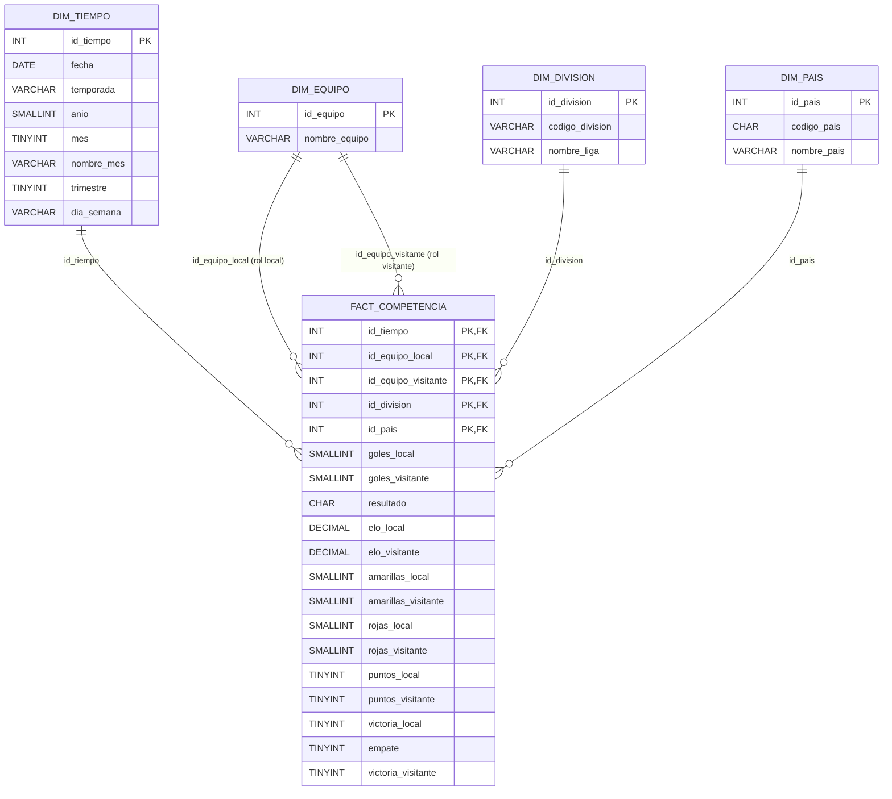

# Paso 3: Modelo Lógico del Data Warehouse (Metodología HEFESTO)

**Punto de partida:** Modelo Conceptual Ampliado de `entrega_fuente_datos.md` (Paso 2).

---

## a) Tipo de Modelo Lógico del DW

Para la construcción del Data Warehouse se seleccionó un **Esquema en Estrella (Star Schema)**.

### Justificación de la elección:

1. **Unicidad del Proceso de Negocio:** El análisis se centra en un único proceso de negocio/evento transaccional atómico: la **Competencia entre Equipos** (cada registro representa un partido disputado). No existen múltiples procesos interconectados que justifiquen un esquema en constelación.  
2. **Dimensiones Independientes y Eficiencia de Consultas:** Se modela la perspectiva geográfica de **País** de forma independiente mediante la dimensión `DIM_PAIS`, conectada directamente a la tabla central de hechos en un esquema en estrella. Esto permite filtrar y comparar los resultados de la competencia y los niveles Elo directamente a nivel país sin forzar una normalización en cascada División → País (copo de nieve), optimizando el tiempo de respuesta en consultas analíticas y herramientas de BI.  
3. **Roles de Dimensión (Role-Playing Dimensions):** La dimensión `DIM_EQUIPO` interactúa dos veces con la tabla de hechos a través de dos roles claramente diferenciados: equipo en condición de local y equipo en condición de visitante (rival). Esto se resuelve de forma óptima mediante un esquema en estrella con claves foráneas apuntando al catálogo unificado de equipos.

---

## b) Tablas de Dimensiones

Siguiendo la metodología HEFESTO, cada perspectiva identificada en el modelo conceptual conforma una tabla de dimensión. Se asigna un nombre formal, se añade una nueva clave principal subrogada entera (autoincremental) independiente de los sistemas de origen, y se estandarizan los nombres de los atributos.

### 1\. Dimensión: `DIM_TIEMPO`

* **Perspectiva de origen:** Tiempo.  
* **Clave primaria nueva:** `id_tiempo` (INT, Clave subrogada autoincremental).  
* **Campos:**  
  * `fecha`: Fecha calendario del partido (`MatchDate`).  
  * `temporada`: Ciclo competitivo deportivo (calculado a partir de `MatchDate`).  
  * `anio`: Año calendario (calculado a partir de `MatchDate`).  
  * `mes`: Mes calendario (1-12).  
  * `nombre_mes`: Nombre del mes en texto (Enero, Febrero, etc.).  
  * `trimestre`: Trimestre del año (1-4).  
  * `dia_semana`: Nombre del día de la semana (Lunes, Martes, etc.).

### 2\. Dimensión: `DIM_EQUIPO`

* **Perspectiva de origen:** Equipo (Club) / Rival (utilizada para los roles de Local y Visitante).  
* **Clave primaria nueva:** `id_equipo` (INT, Clave subrogada autoincremental).  
* **Campos:**  
  * `nombre_equipo`: Nombre canónico y unificado del club (`HomeTeam` / `AwayTeam` de `Matches.csv`, con `TRIM` y la tabla de mapeo de variantes de escritura detectadas en el Paso 2).

### 3\. Dimensión: `DIM_DIVISION`

* **Perspectiva de origen:** División / Liga.  
* **Clave primaria nueva:** `id_division` (INT, Clave subrogada autoincremental).  
* **Campos:**  
  * `codigo_division`: Código de liga original del archivo (`Division`, ej. 'E0', 'SP1', 'T1').  
  * `nombre_liga`: Nombre descriptivo y oficial de la competición (ej. 'Premier League', 'La Liga').

### 4\. Dimensión: `DIM_PAIS`

* **Perspectiva de origen:** País.  
* **Clave primaria nueva:** `id_pais` (INT, Clave subrogada autoincremental).  
* **Campos:**  
  * `codigo_pais`: Código de tres letras del país, obtenido del mapeo de `Division` (ej. 'ENG', 'ESP', 'TUR').  
  * `nombre_pais`: Nombre completo del país (ej. 'Inglaterra', 'España', 'Turquía').

---

## c) Tablas de Hechos

Se diseña una única tabla de hechos central que almacena las métricas atómicas del encuentro para responder a todas las preguntas de negocio e indicadores definidos en el Paso 2 (sin cuotas, tiros ni faltas, manteniendo disciplina, resultados y puntos). Los indicadores calculados del Paso 2 (promedios, porcentajes, paridad, evolución de Elo, etc.) se obtienen en las consultas agregando estos hechos.

### Tabla de Hechos: `FACT_COMPETENCIA`

* **Proceso de negocio modelado:** Competencia entre Equipos (partidos disputados).  
* **Granularidad:** Un registro por cada partido individual disputado en una fecha, liga y país determinado.  
* **Clave Primaria Compuesta:** Combinación de las claves foráneas de las dimensiones relacionadas:  
  * `id_tiempo` (FK a `DIM_TIEMPO`)  
  * `id_equipo_local` (FK a `DIM_EQUIPO`)  
  * `id_equipo_visitante` (FK a `DIM_EQUIPO`)  
  * `id_division` (FK a `DIM_DIVISION`)  
  * `id_pais` (FK a `DIM_PAIS`)  
* **Hechos (un campo por cada medida de la competencia):**  
  * `goles_local`: Goles finales anotados por el local (`FTHome`).  
  * `goles_visitante`: Goles finales anotados por el visitante (`FTAway`).  
  * `resultado`: Código del resultado definitivo del partido (`FTResult`: 'H', 'D', 'A').  
  * `elo_local`: Puntuación Elo del equipo local al momento del encuentro (`HomeElo`). Admite `NULL`.  
  * `elo_visitante`: Puntuación Elo del equipo visitante al momento del encuentro (`AwayElo`). Admite `NULL`.  
  * `amarillas_local`: Tarjetas amarillas del local (`HomeYellow`). Admite `NULL` (liga sin dato).  
  * `amarillas_visitante`: Tarjetas amarillas del visitante (`AwayYellow`). Admite `NULL`.  
  * `rojas_local`: Tarjetas rojas del local (`HomeRed`). Admite `NULL`.  
  * `rojas_visitante`: Tarjetas rojas del visitante (`AwayRed`). Admite `NULL`.  
  * `puntos_local`: Puntos de tabla obtenidos por el local (3 por victoria 'H', 1 por empate 'D', 0 por derrota 'A').  
  * `puntos_visitante`: Puntos de tabla obtenidos por el visitante (3 por victoria 'A', 1 por empate 'D', 0 por derrota 'H').  
  * `victoria_local`: Bandera binaria indicadora de victoria local (1 si `resultado = 'H'`, 0 en caso contrario).  
  * `empate`: Bandera binaria indicadora de empate (1 si `resultado = 'D'`, 0 en caso contrario).  
  * `victoria_visitante`: Bandera binaria indicadora de victoria visitante (1 si `resultado = 'A'`, 0 en caso contrario).

---

## d) Uniones (Diagrama del Modelo Lógico Final)

A continuación se detalla el diagrama lógico resultante, con la tabla de hechos central y las dimensiones unidas por sus respectivas claves foráneas:

---

**Verificación del DDL:** `entrega_modelo_logico.sql` se ejecutó contra MySQL 8.0.45 (lo ejecuta `paso-4/01_carga_dw.ipynb` como primer paso de cada carga) y compila sin errores.
